## Fira Code: la fuente monoespaciada con ligaduras gratuita para programación


Leer en [English](./README.md) | [简体中文](./README_CN.md) | [日本語](./README_JA.md)

### El problema

Los programadores usamos muchos símbolos, frecuentemente codificados con varios caracteres. Para el cerebro humano, sucesiones como `->`, `<=` o `:=` son unidades lógicas individuales, incluso si requieren dos o más caracteres en pantalla. Nuestros ojos utilizan una cantidad no nula de energía para leer, analizar y unir caracteres mútiples en una sola unidad lógica. Idealmente, todos los lenguajes de programación deberían estar diseñados para representar los operadores con símbolos Unicode; pero ese no es el caso aún.

### La solución

Fira Code es una fuente monoespaciada gratuita que contiene ligaduras para combinaciones multicaracter comunes en programación. Esta es simplemente una característica del renderizado de la fuente: el código subyacente permanece compatible con el estándar ASCII. Esto ayuda a leer y comprender más rápido el código. Para algunas sucesiones comunes, como `..` o `//`, las ligaduras nos permiten hacer correcciones en el espaciado.

### Descarga e instalación

<a href="https://github.com/tonsky/FiraCode/releases/download/6.2/Fira_Code_v6.2.zip">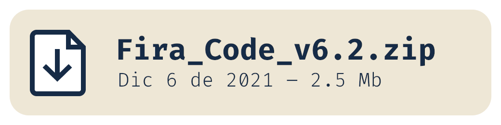</a>

Recursos adicionales (en inglés):

- [Cómo instalar](https://github.com/tonsky/FiraCode/wiki)
- [Resolución de problemas](https://github.com/tonsky/FiraCode/wiki#troubleshooting)
- [Noticias e información](https://twitter.com/FiraCode)

### Contribuyendo

<a href="https://github.com/sponsors/tonsky" target="_blank">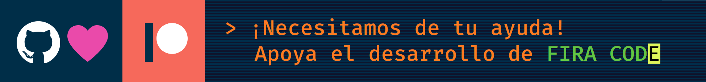</a>

Fira Code es un proyecto personal desarrollado en mi tiempo libre, sin financiamiento y con una enorme [lista de solicitudes](https://github.com/tonsky/FiraCode/issues). Si el resultado es de tu agrado, por favor considera apoyar a su desarrollo por medio de [GitHub Sponsors](https://github.com/sponsors/tonsky) o [Patreon](https://patreon.com/tonsky). ¡Cualquier ayuda cuenta!

### ¿Qué ofrece?

Izquierda: ligaduras renderizadas en Fira Code. Derecha: las mismas secuencias de caracteres sin ligaduras.

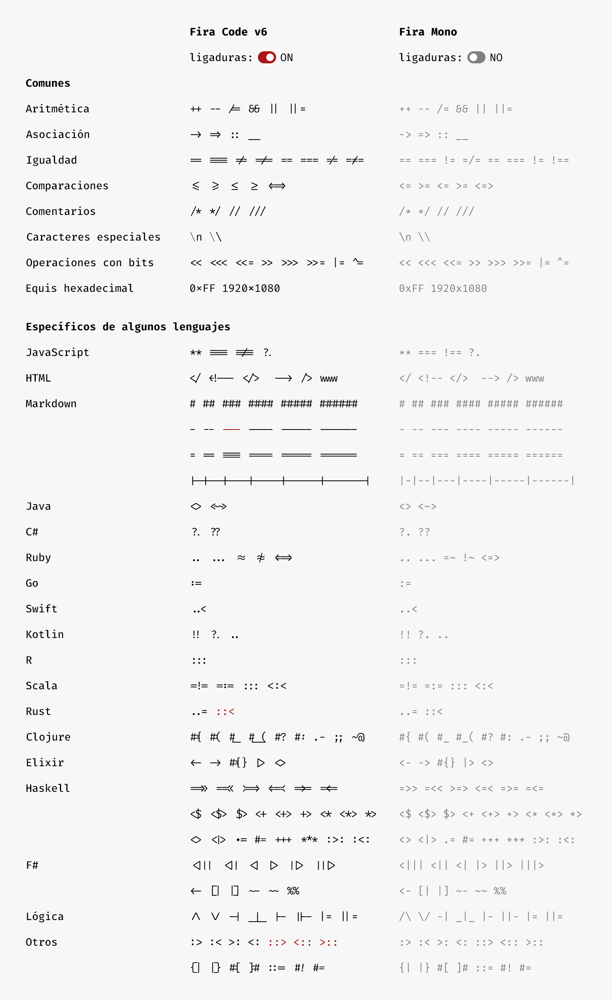

Fira Code viene con una gran variedad de flechas. Mejor aun, ¡estas pueden hacerse tan largas como se desee y se pueden combinar los fragmentos incial/medio/final de la forma que se quiera!

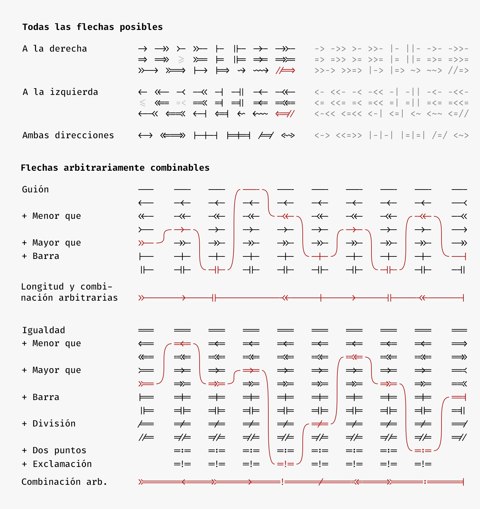

Fira Code no solo se trata de las ligaduras. Algunos ajustes se han hecho a la puntuación y a pares de letras frecuentes.

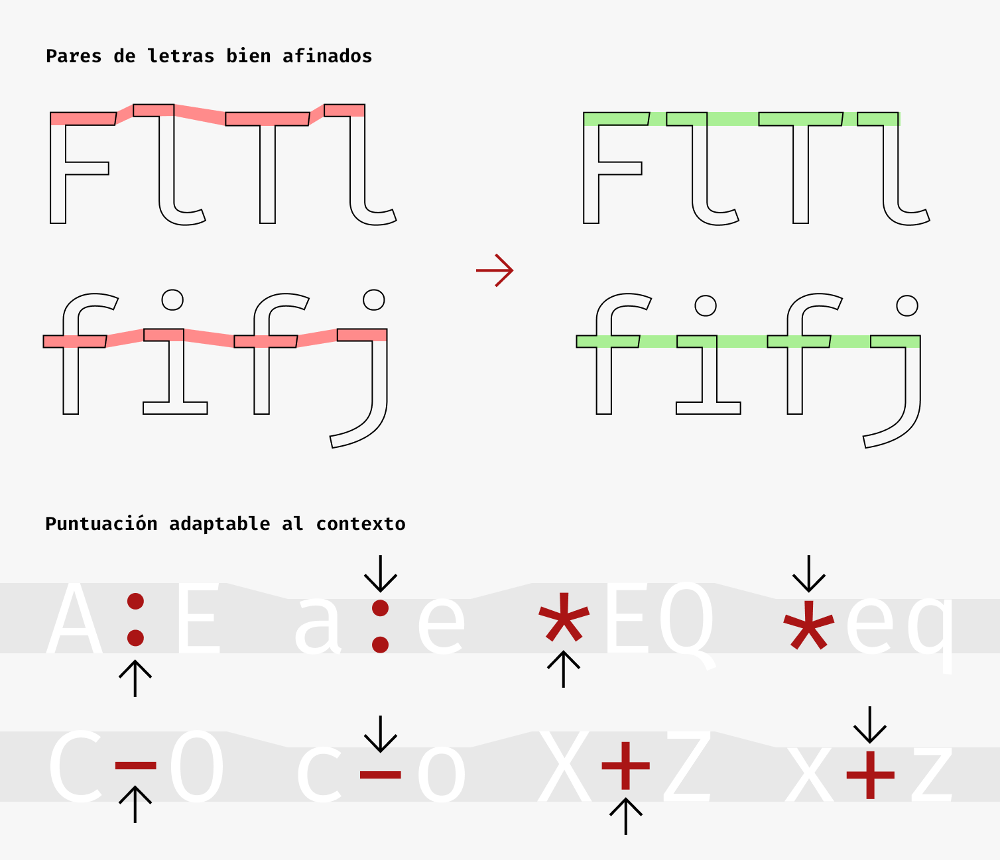

Fira Code viene con algunas variantes de caracteres, de manera que cada uno puede escoger lo que mejor le convenga. [Cómo activar (en inglés)](https://github.com/tonsky/FiraCode/wiki/How-to-enable-stylistic-sets)

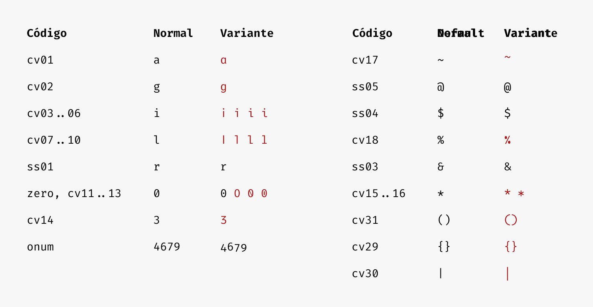

Algunas ligaduras pueden alterarse o activarse usando conjuntos estilísticos/variantes de caracteres:

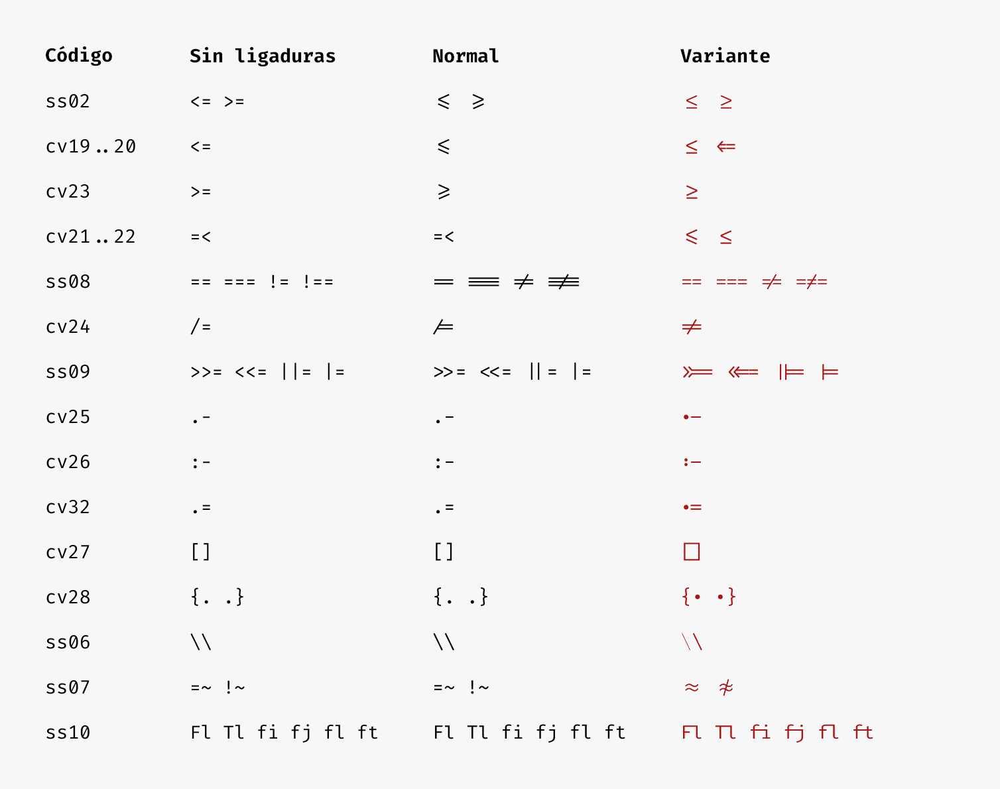

Siendo una fuente para programación, Fira Code tiene un soporte fantástico para dibujos ASCII/de cajas, powerline y otras formas de interfaz de usuario para terminal:

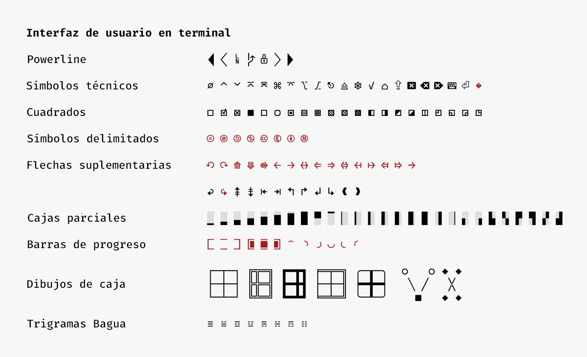

Fira Code es la primera fuente para programación en ofrecer glifos dedicados al dibujo de barras de progreso:


En acción:

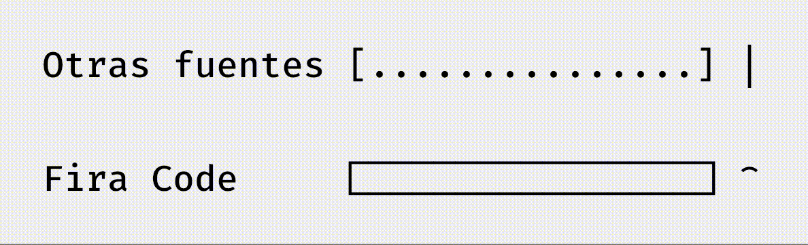

Esperamos que más fuentes adopten esta convención y definan sus propias versiones.

La covertura del estándar Unicode hace de Fira Code una gran elección para la escritura matemática:

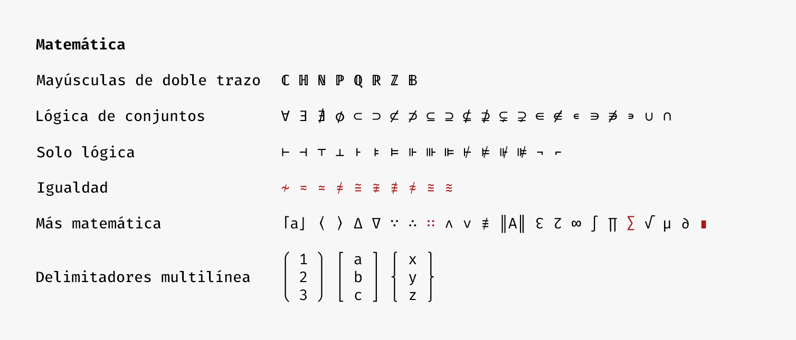

### ¿Cómo luce?

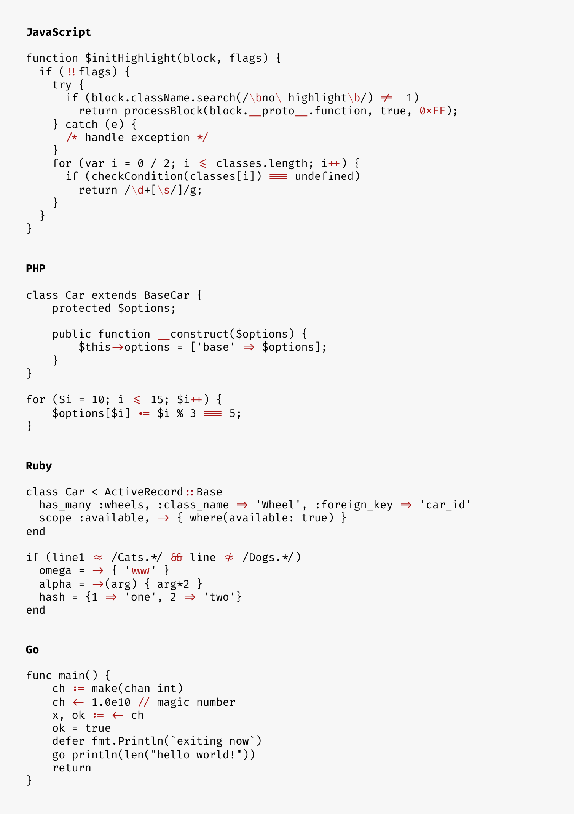
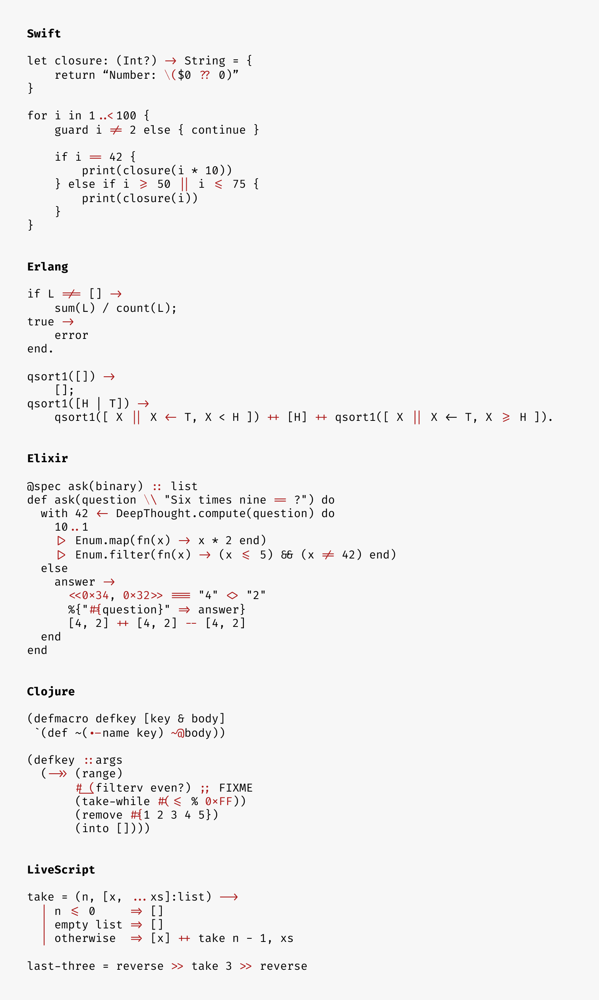

### Lista de compatibilidad con editores

| Funciona | No funciona |
|----------|-------------|
| **Abricotine** | **Arduino IDE** |
| **Android Studio** (2.3+, [instrucciones](https://github.com/tonsky/FiraCode/wiki/Intellij-products-instructions)) | **Adobe Dreamweaver** |
| **Anjuta** (excepto con EOF) | **Delphi IDE** |
| **AppCode** (2016.2+, [instrucciones](https://github.com/tonsky/FiraCode/wiki/Intellij-products-instructions)) | **Emacs** por sí solo ([solución alternativa](https://github.com/tonsky/FiraCode/wiki/Emacs-instructions)) |
| **Atom** 1.1 o más nuevo ([instrucciones](https://github.com/tonsky/FiraCode/wiki/Atom-instructions)) | **Godot** ([reporte](https://github.com/godotengine/godot/issues/9961)) |
| **BBEdit** (14.6+, [instrucciones](https://github.com/tonsky/FiraCode/wiki/BBEdit-instructions)) | **IDLE** |
| **Brackets** (con [este plugin](https://github.com/polo2ro/firacode-in-brackets)) | **KDevelop 4** |
| **Chocolat** | **Monkey Studio IDE** |
| **CLion** (2016.2+, [instrucciones](https://github.com/tonsky/FiraCode/wiki/Intellij-products-instructions)) | **UltraEdit** |
| **Cloud9** ([instrucciones](https://github.com/tonsky/FiraCode/wiki/Cloud9-Instructions)) | 
| **Coda 2** |
| **CodeLite** |
| **CodeRunner** |
| **CotEditor** |
| **Eclipse** |
| **elementary Code** |
| **Geany** (1.37+) |
| **gEdit / Pluma** |
| **GNOME Builder** |
| **GoormIDE** ([instrucciones](https://github.com/tonsky/FiraCode/wiki/GoormIDE-Instructions)) |
| **gVim** ([Windows](https://github.com/tonsky/FiraCode/issues/462), [GTK](https://vimhelp.org/options.txt.html#%27guiligatures%27)) |
| **IntelliJ IDEA** (2016.2+, [instrucciones](https://github.com/tonsky/FiraCode/wiki/Intellij-products-instructions)) |
| **Kate, KWrite** |
| **KDevelop 5+** |
| **Komodo** |
| **Leafpad** |
| **LibreOffice** |
| **LightTable** ([instrucciones](https://github.com/tonsky/FiraCode/wiki/LightTable-instructions)) |
| **LINQPad** |
| **MacVim** 7.4 o más nuevo ([instrucciones](https://github.com/tonsky/FiraCode/wiki/MacVim-instructions)) |
| **Mancy** |
| **MATLAB** ([instrucciones](https://github.com/tonsky/FiraCode/wiki/MATLAB-for-Windows-Instructions)) |
| **Meld** |
| **Mousepad** |
| **NeoVim-gtk** |
| **NetBeans** |
| **Notepad** (Windows) |
| **Notepad++** (con una [solución alternativa](https://github.com/notepad-plus-plus/notepad-plus-plus/issues/2287#issuecomment-256638098))  |
| **Notepad3** ([instrucciones](https://github.com/rizonesoft/Notepad3/issues/361#issuecomment-365977420))|
| **Nova** |
| **PhpStorm** (2016.2+, [instrucciones](https://github.com/tonsky/FiraCode/wiki/Intellij-products-instructions)) |
| **PyCharm** (2016.2+, [instrucciones](https://github.com/tonsky/FiraCode/wiki/Intellij-products-instructions)) |
| **QOwnNotes** (21.16.6+) |
| **QtCreator** |
| **Rider** |
| **RStudio** ([instrucciones](https://github.com/tonsky/FiraCode/wiki/RStudio-instructions)) |
| **RubyMine** (2016.2+, [instrucciones](https://github.com/tonsky/FiraCode/wiki/Intellij-products-instructions)) |
| **Scratch** |
| **Scribus** (1.5.3+) |
| **SublimeText** (3146+) |
| **Spyder IDE** (solamente con Qt5) |
| **SuperCollider 3** |
| **TeXShop** |
| **TextAdept** (Linux, macOS) |
| **TextEdit** |
| **TextMate 2** |
| **VimR** ([instrucciones](https://github.com/qvacua/vimr/wiki#ligatures)) |
| **Visual Studio** (2015+, [instrucciones](https://github.com/tonsky/FiraCode/wiki/Visual-Studio-Instructions)) |
| **Visual Studio Code** ([instrucciones](https://github.com/tonsky/FiraCode/wiki/VS-Code-Instructions)) |
| **WebStorm** (2016.2+, [instrucciones](https://github.com/tonsky/FiraCode/wiki/Intellij-products-instructions)) |
| **Xamarin Studio/Monodevelop** |
| **Xcode** (8.0+, alternativamente con [este plugin](https://github.com/robertvojta/LigatureXcodePlugin)) |
| **Xi** |
| Probablemente: **Smultron, Vico** | En duda: **Code::Blocks IDE** |

### Lista de compatibilidad con terminales

| Plataforma     | Funciona | No funciona |
|----------------|----------|-------------|
| macOS          | Hyper (ver [#3607](https://github.com/vercel/hyper/issues/3607))<br>iTerm 2<br>Kitty<br>Terminal.app<br>ZOC | Alacritty |
| Windows        | Hyper (ver [#3607](https://github.com/vercel/hyper/issues/3607))<br>Mintty<br>Token2Shell<br>Windows Terminal | Alacritty<br>Cmder<br>ConEmu<br>PuTTY<br>Windows Console<br>ZOC |
| Linux          | Hyper (ver [#3607](https://github.com/vercel/hyper/issues/3607))<br>Kitty<br>Konsole<br>QTerminal<br>Termux<br>st ([parche](https://st.suckless.org/patches/ligatures/)) | Alacritty<br>GNOME Terminal<br>Terminales basadas en libvte ([reporte](https://gitlab.gnome.org/GNOME/vte/-/issues/1661)): <ul><li>gtkterm<li>guake<li>LXTerminal<li> sakura<li>Terminator<li>xfce4-terminal</ul>mate-terminal<br>rxvt<br>terminology<br>xterm
| ChromeOS       | crosh ([instrucciones](https://github.com/tonsky/FiraCode/wiki/ChromeOS-Terminal)) | |

### Soporte en el navegador web

```html
<!-- HTML -->
<link rel="stylesheet" href="https://cdn.jsdelivr.net/npm/firacode@6.2.0/distr/fira_code.css">
```

```css
/* CSS */
@import url(https://cdn.jsdelivr.net/npm/firacode@6.2.0/distr/fira_code.css);
```

```css
/* Especificar en el CSS */
code { font-family: 'Fira Code', monospace; }

@supports (font-variation-settings: normal) {
  code { font-family: 'Fira Code VF', monospace; }
}
```

- IE 10+, Edge Legacy: activar con `font-feature-settings: "calt";`
- Firefox
- Safari
- Navegadores basados en Chromium (Chrome, Opera)
- ACE
- CodeMirror (activar con `font-variant-ligatures: contextual;`)

### Proyectos que usan Fira Code

- [CodePen](https://codepen.io/)
- [Blink Shell](http://www.blink.sh/)
- [Klipse](http://app.klipse.tech/)
- [IlyaBirman.net](http://ilyabirman.net/)
- [EvilMartians.com](https://evilmartians.com/)
- [Web Maker](https://webmakerapp.com/)
- [FromScratch](https://fromscratch.rocks/)
- [PEP20.org](https://pep20.org/)

### Alternativas

Fuentes monoespaciadas con ligaduras gratuitas:

- [Hasklig](https://github.com/i-tu/Hasklig)
- [Monoid](http://larsenwork.com/monoid/)
- [Fixedsys Excelsior](https://github.com/kika/fixedsys)
- [Iosevka](https://be5invis.github.io/Iosevka/)
- [DejaVu Sans Code](https://github.com/SSNikolaevich/DejaVuSansCode)
- [Victor Mono](https://rubjo.github.io/victor-mono/)
- [Cascadia Code](https://github.com/microsoft/cascadia-code)
- [JetBrains Mono](https://github.com/JetBrains/JetBrainsMono)

Fuentes monoespaciadas con ligaduras no gratuitas:

- [PragmataPro](http://www.fsd.it/fonts/pragmatapro.htm)
- [Mono Lisa](https://www.monolisa.dev/)

### Compilando Fira Code localmente

En caso que se quiera modificar el código en FiraCode.glyphs y compilar archivos OTF/TTF/WOFF propios, estas son las instrucciones que uso en macOS:

```bash
# instalar las herramientas requeridas para la compilación
./script/bootstrap_macos.sh

# compilar los archivos de la fuente
./script/build.sh

# instalar los OTFs en ~/Library/Fonts
cp distr/otf/*.otf ~/Library/Fonts
```

Alternativamnete, se puede compilar Fira Code usando Docker:

```bash
# instalar las dependencias en un contenedor y compilar los archivos de la fuente
make

# comprimir los archivos de la fuente en dist/ a un zip
make package
```

### Créditos

- Autor: Nikita Prokopov [@nikitonsky](https://twitter.com/nikitonsky)
- Basado en: [Fira Mono](https://github.com/mozilla/Fira)
- Inspirado por: [Hasklig](https://github.com/i-tu/Hasklig)
