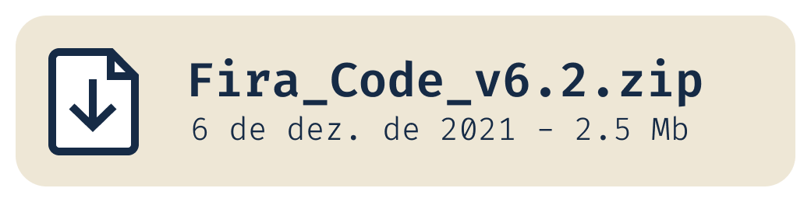
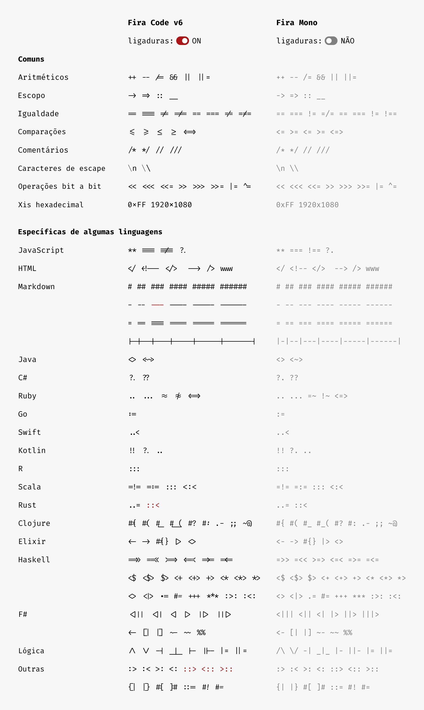
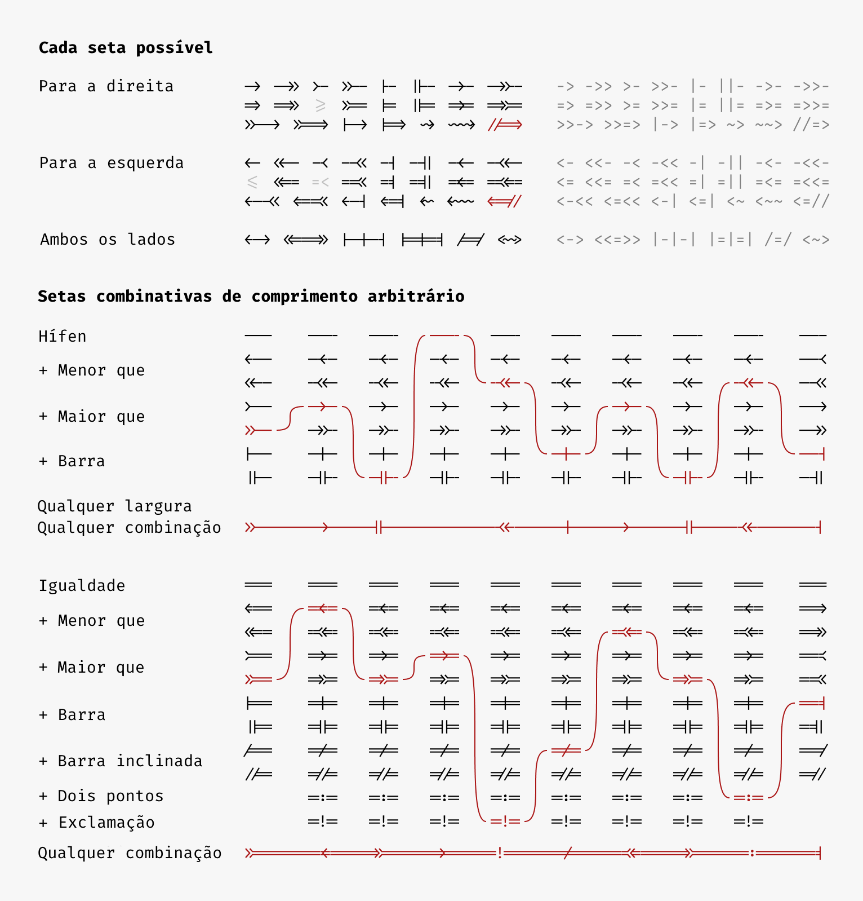
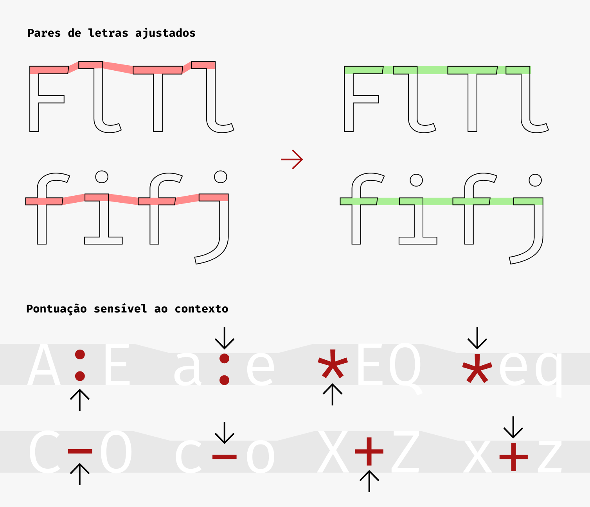
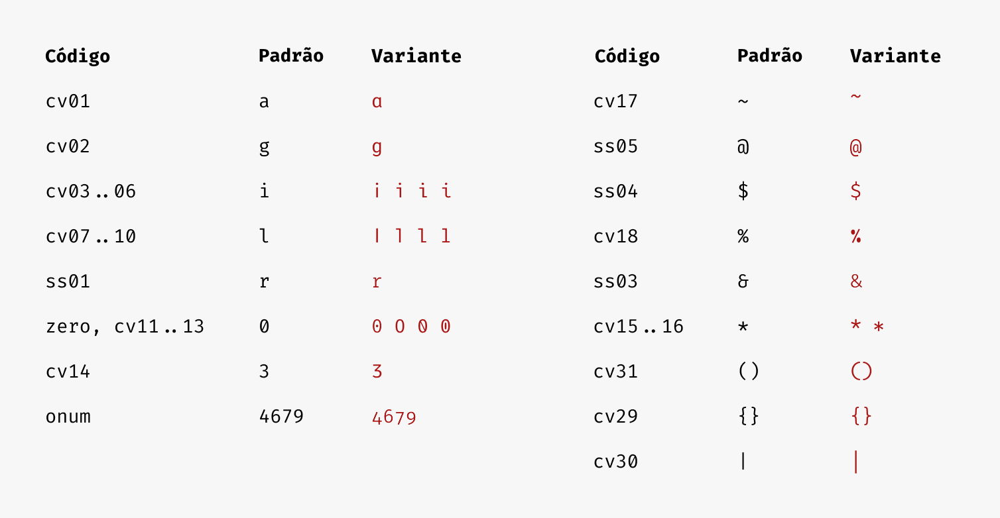
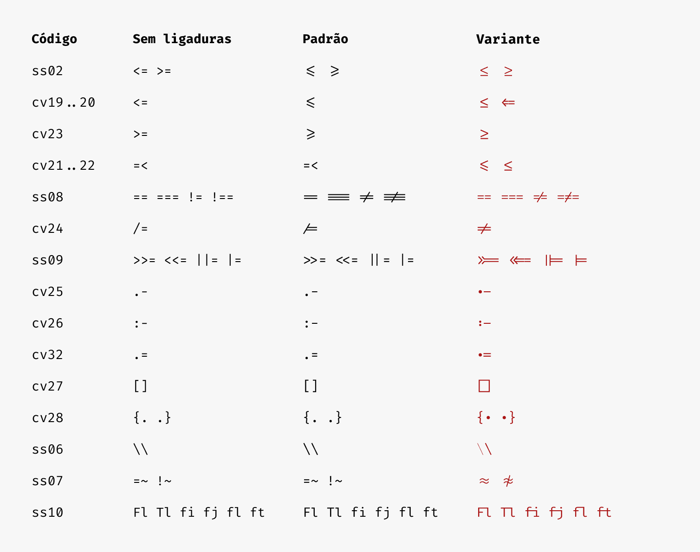
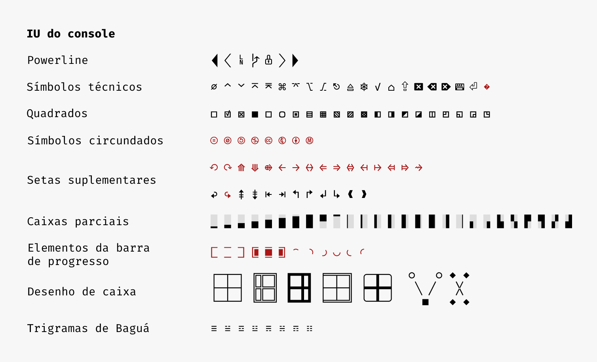
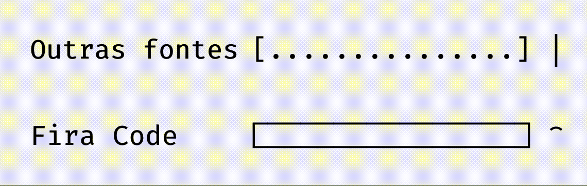
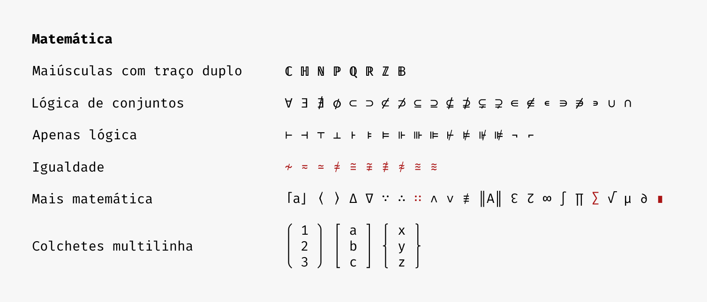

## Fira Code: uma fonte monoespaçada gratuita com ligaduras de programação


Leia em: [English](./README.md) | [Español](./LEEME.md) | [简体中文](./README_CN.md) | [日本語](./README_JA.md)

### Problema

Os programadores usam muitos símbolos, frequentemente codificados com vários caracteres. Para a mente humana, sequências como `->`, `<=` ou `:=` são tokens lógicos únicos, mesmo que ocupem dois ou três caracteres na tela. Seus olhos gastam uma quantidade quase nula de energia para escanear, analisar e unir vários caracteres num único caractere lógico. Idealmente, todas as linguagens de programação deveriam ser projetadas com símbolos Unicode completos para operadores, mas este ainda não é o caso.

### Solução

Fira Code é uma fonte monoespaçada gratuita que contém ligaduras para combinações comuns de vários caracteres na programação. É apenas um recurso de renderização de fonte: o código subjacente permanece compatível com ASCII. Isso ajuda com a ler e entender o código mais rapidamente. Para algumas sequências frequentes, como `..` ou `//`, as ligaduras nos permitem corrigir o espaçamento.

### Baixar e instalar

<a href="https://github.com/tonsky/FiraCode/releases/download/6.2/Fira_Code_v6.2.zip"></a>

E então, consulte:

- [Como instalar](https://github.com/tonsky/FiraCode/wiki)
- [Solução de problemas](https://github.com/tonsky/FiraCode/wiki#troubleshooting)
- [Novidades e atualizações](https://twitter.com/FiraCode)

### Patrocinadores

Fira Code é um projeto pessoal, de tempo livre, sem financiamento, e com com uma enorme [lista de solicitações de recursos](https://github.com/tonsky/FiraCode/issues). Se você gostou, considere apoiar seu desenvolvimento por meio do [GitHub Sponsors](https://github.com/sponsors/tonsky) ou [Patreon](https://patreon.com/tonsky). Qualquer ajuda é bem-vinda!

### O que o acompanha?

À esquerda: as ligaduras conforme renderizadas no Fira Code. À direita: as mesmas sequências de caracteres sem ligaduras.



Fira Code vem com uma grande variedade de setas. Melhor ainda: você pode deixá-las do tamanho que quiser e combinar os fragmentos de início, meio e fim como preferir!



Fira Code não é só sobre ligaduras. A pontuação e pares de letras frequentes também contam com alguns ajustes finos.



Fira Code vem com algumas variantes de caracteres diferentes (`cv01`, `cv02` etc.), conjuntos de estilo (`ss01`, `ss02` etc.) e outros recursos de fonte (`zero`, `onum`, `calt`  etc.) para que todos possam escolher o que é melhor para si. [Veja como habilitar](https://github.com/tonsky/FiraCode/wiki/How-to-enable-stylistic-sets).



Algumas ligaduras podem ser alteradas ou habilitadas usando conjuntos de estilo ou variantes de caracteres:



Por ser uma fonte de programação, o Fira Code possui um suporte fantástico para desenhar ASCII ou caixas, *powerline* e outras formas de IU do console:



Fira Code é a primeira fonte de programação a oferecer glifos dedicados para renderizar barras de progresso:


Em ação:



Esperamos que mais fontes de programação adotem esta convenção e lancem suas próprias versões.

A cobertura Unicode torna o Fira Code uma ótima escolha para escrita matemática:



### Como se parece?


### Lista de editores compatíveis

| Funciona | Não funciona |
|----------|--------------|
| **Arduino IDE** (2.0+, segue as mesmas<br>instruções do [vscode](https://github.com/tonsky/FiraCode/wiki/VS-Code-Instructions)) | **Adobe Dreamweaver** |
| **Abricotine** | **Delphi IDE** |
| **Android Studio** (2.3+, [instruções](https://github.com/tonsky/FiraCode/wiki/IntelliJ-products-instructions)) | Standalone **Emacs** ([solução alternativa](https://github.com/tonsky/FiraCode/wiki/Emacs-instructions)) |
| **Anjuta** (a menos que no EOF) |  **IDLE** |
| **AppCode** (2016.2+, [instruções](https://github.com/tonsky/FiraCode/wiki/IntelliJ-products-instructions)) | **KDevelop 4** |
| **Atom** 1.1 ou mais recente ([instruções](https://github.com/tonsky/FiraCode/wiki/Atom-instructions)) | **Monkey Studio IDE** |
| **BBEdit** (14.6+ [instruções](https://github.com/tonsky/FiraCode/wiki/BBEdit-instructions)) | **UltraEdit** (Windows) |
| **Brackets** (com [este plugin](https://github.com/polo2ro/firacode-in-brackets)) | 
| **Chocolat** |
| **CLion** (2016.2+, [instruções](https://github.com/tonsky/FiraCode/wiki/IntelliJ-products-instructions)) | 
| **Cloud9** ([instruções](https://github.com/tonsky/FiraCode/wiki/Cloud9-Instructions)) | 
| **Coda 2** |
| **CodeLite** |
| **CodeRunner** |
| **Comma** (Em: Preferências > Editor > Fonte) |
| **CotEditor** |
| **Eclipse** |
| **EditPad** |
| **elementary Code** |
| **Geany** (1.37+) |
| **gEdit / Pluma** |
| **GNOME Builder** |
| **Godot** |
| **GoormIDE** ([instruções](https://github.com/tonsky/FiraCode/wiki/GoormIDE-Instructions)) |
| **gVim** ([Windows](https://github.com/tonsky/FiraCode/issues/462), [GTK](https://vimhelp.org/options.txt.html#%27guiligatures%27)) |
| **IntelliJ IDEA** (2016.2+, [instruções](https://github.com/tonsky/FiraCode/wiki/IntelliJ-products-instructions)) |
| **Kate, KWrite** |
| **KDevelop 5+** |
| **Komodo** |
| **Leafpad** |
| **LibreOffice** |
| **LightTable** ([instruções](https://github.com/tonsky/FiraCode/wiki/LightTable-instructions)) |
| **LINQPad** |
| **MacVim** 7.4 ou mais recente ([instruções](https://github.com/tonsky/FiraCode/wiki/MacVim-instructions)) |
| **Mancy** |
| **MATLAB** ([instruções](https://github.com/tonsky/FiraCode/wiki/MATLAB-for-Windows-Instructions)) |
| **Meld** |
| **Mousepad** |
| **NeoVim-gtk** |
| **NetBeans** |
| **Notepad** (Windows) |
| **Notepad++** ([instruções](https://github.com/tonsky/FiraCode/issues/1555))  |
| **Notepad3** ([instruções](https://github.com/rizonesoft/Notepad3/issues/361#issuecomment-365977420))|
| **Nova** |
| **PhpStorm** (2016.2+, [instruções](https://github.com/tonsky/FiraCode/wiki/IntelliJ-products-instructions)) |
| **PyCharm** (2016.2+, [instruções](https://github.com/tonsky/FiraCode/wiki/IntelliJ-products-instructions)) |
| **QOwnNotes** (21.16.6+) |
| **QtCreator** |
| **Rider** |
| **RStudio** ([instruções](https://github.com/tonsky/FiraCode/wiki/RStudio-instructions)) |
| **RubyMine** (2016.2+, [instruções](https://github.com/tonsky/FiraCode/wiki/IntelliJ-products-instructions)) |
| **Scratch** |
| **Scribus** (1.5.3+) |
| **SublimeText** (3146+) |
| **Spyder IDE** (apenas com Qt5) |
| **SuperCollider 3** |
| **TeXShop**|
| **TextAdept** (Linux, macOS) |
| **TextEdit** |
| **TextMate 2** |
| **UltraEdit (UEX)** (Linux) |
| **VimR** ([instruções](https://github.com/qvacua/vimr/wiki#ligatures)) |
| **Visual Studio** (2015+, [instruções](https://github.com/tonsky/FiraCode/wiki/Visual-Studio-Instructions)) |
| **Visual Studio Code** ([instruções](https://github.com/tonsky/FiraCode/wiki/VS-Code-Instructions)) |
| **WebStorm** (2016.2+, [instruções](https://github.com/tonsky/FiraCode/wiki/IntelliJ-products-instructions)) |
| **Xamarin Studio/Monodevelop** |
| **Xcode** (8.0+, caso contrário, [com plugin](https://github.com/robertvojta/LigatureXcodePlugin)) |
| **Xi** |
| Provavelmente funciona: **Smultron, Vico** | Em questão: **Code::Blocks IDE** |

### Lista de terminais compatíveis

| Funciona | Não funciona |
|----------|--------------|
| crosh ([instruções](https://github.com/tonsky/FiraCode/wiki/ChromeOS-Terminal)) | Alacritty |
| Ghostty | Asbru Connection Manager |
| Hyper (veja [#3607](https://github.com/vercel/hyper/issues/3607)) | Cmder |
| iTerm 2 | ConEmu |
| Kitty | GNOME Terminal ([ticket](https://gitlab.gnome.org/GNOME/vte/-/issues/192)) |
| Konsole | gtkterm ([ticket](https://gitlab.gnome.org/GNOME/vte/-/issues/1661)) |
| Mintty | guake ([ticket](https://gitlab.gnome.org/GNOME/vte/-/issues/1661)) |
| QTerminal | LXTerminal ([ticket](https://gitlab.gnome.org/GNOME/vte/-/issues/1661)) |
| st ([correção](https://st.suckless.org/patches/ligatures/)) | mate-terminal |
| Tabby | PuTTY |
| Terminal.app | rxvt |
| Termux | sakura ([ticket](https://gitlab.gnome.org/GNOME/vte/-/issues/1661)) |
| Token2Shell | SecureCRT
| Wez’s terminal | Terminator ([ticket](https://gitlab.gnome.org/GNOME/vte/-/issues/1661)) |
| Windows Terminal | terminology |
| ZOC (macOS) | Tilix |
| | Windows Console |
| | xfce4-terminal ([ticket](https://gitlab.gnome.org/GNOME/vte/-/issues/1661)) |
| | xterm |
| | ZOC (Windows) |

### Suporte com navegadores

```html
<!-- HTML -->
<link rel="stylesheet" href="https://cdn.jsdelivr.net/npm/firacode@6.2.0/distr/fira_code.css">
```

```css
/* CSS */
@import url(https://cdn.jsdelivr.net/npm/firacode@6.2.0/distr/fira_code.css);
```

```css
/* Especifique em CSS */
code { font-family: 'Fira Code', monospace; }

@supports (font-variation-settings: normal) {
  code { font-family: 'Fira Code VF', monospace; }
}
```

- IE 10+, Edge Legacy: habilite com `font-feature-settings: "calt";`
- Firefox
- Safari
- Navegadores baseados em Chromium (Chrome, Opera)
- ACE
- CodeMirror (habilite com `font-variant-ligatures: contextual;`)

### Projetos usando Fira Code

- [CodePen](https://codepen.io/)
- [Blink Shell](http://www.blink.sh/)
- [Klipse](http://app.klipse.tech/)
- [IlyaBirman.net](http://ilyabirman.net/)
- [EvilMartians.com](https://evilmartians.com/)
- [Web Maker](https://webmakerapp.com/)
- [FromScratch](https://fromscratch.rocks/)
- [PEP20.org](https://pep20.org/)

### Alternativas

Fontes monoespaçadas gratuitas com ligaduras:

- [Hasklig](https://github.com/i-tu/Hasklig)
- [Monoid](http://larsenwork.com/monoid/)
- [Fixedsys Excelsior](https://github.com/kika/fixedsys)
- [Iosevka](https://be5invis.github.io/Iosevka/)
- [DejaVu Sans Code](https://github.com/SSNikolaevich/DejaVuSansCode)
- [Victor Mono](https://rubjo.github.io/victor-mono/)
- [Cascadia Code](https://github.com/microsoft/cascadia-code)
- [JetBrains Mono](https://github.com/JetBrains/JetBrainsMono)

Fontes monoespaçadas pagas com ligaduras:

- [PragmataPro](http://www.fsd.it/fonts/pragmatapro.htm)
- [Mono Lisa](https://www.monolisa.dev/)

### Construir o Fira Code localmente

Caso deseje alterar os FiraCode.glyphs e construir você mesmo os arquivos OTF/TTF/WOFF, essa é a configuração que eu uso no macOS:

```bash
# instala todas as ferramentas necessárias para construir
./script/bootstrap_macos.sh

# constrói os arquivos de fonte
./script/build.sh

# instala os OTFs em ~/Library/Fonts
cp distr/otf/*.otf ~/Library/Fonts
```

De forma alternativa, você pode construir o Fira Code usando o Docker:

```bash
# instala as dependências num contêiner e constrói os arquivos de fonte
make

# compacta os arquivos de fonte do dist/ em um zip
make package
```

Se você quiser *habilitar permanentemente* certos conjuntos de estilos ou variações de caracteres, talvez porque o editor de sua escolha não permita que você os alterne individualmente, você pode fornecer os recursos desejados em uma lista separada por vírgulas para o script de compilação por meio da flag  `-f / --features`.<br>Padrão: nenhum.

Para separar diferentes versões da sua fonte, você pode especificar o nome da família da fonte desejada com a flag `-n / --family-name`. O valor especial 'features' adicionará uma lista de recursos habilitados ordenada e separada por espaços ao nome da família padrão.<br>Padrão: "Fira Code"

Você também pode limitar a espessura da fonte que será criada com a opção `-w / --weights`.<br>Padrão: "Light,Regular,Retina,Medium,SemiBold,Bold"

```bash
# localmente no seu shell
./script/build.sh --features "ss02,ss08,ss10,cv03,cv07,cv14" --family-name "Fira Code straight" --weights "Regular,Bold"

# ou por meio de um contêiner docker (cria um nome de família 'Fira Code cv01 cv02 cv06 cv31 onum ss01 ss03 ss04 zero')
docker run --rm -v "${PWD}":/opt tonsky/firacode:latest ./script/build.sh -f "cv01,cv02,cv06,ss01,zero,onum,ss03,ss04,cv31" -n "features"

# no Git Bash do Git for Windows, ou qualquer outro shell baseado em MSYS2, talvez seja necessário desabilitar a conversão de caminho
MSYS2_ARG_CONV_EXCL="*" docker run --rm -v "${PWD}":/opt tonsky/firacode:latest ./script/build.sh -f "ss02,ss03,ss04,ss05,ss06,ss07"
```

### Créditos

- Autor: Nikita Prokopov [@nikitonsky](https://twitter.com/nikitonsky)
- Baseado em: [Fira Mono](https://github.com/mozilla/Fira)
- Inspirado por: [Hasklig](https://github.com/i-tu/Hasklig)
- Traduzido por: Kauan Farias [@kau19an](https://github.com/kau19an)