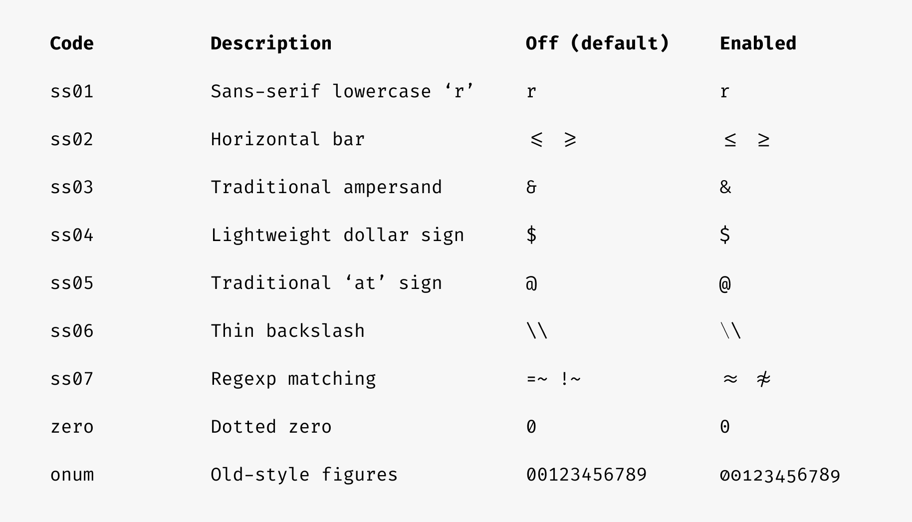
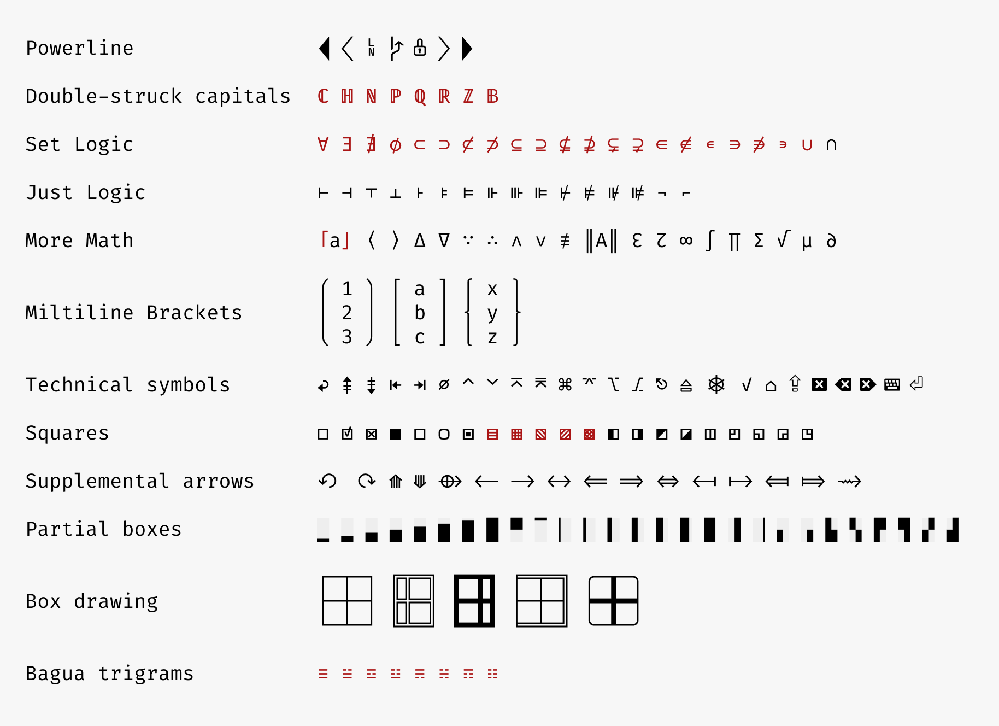
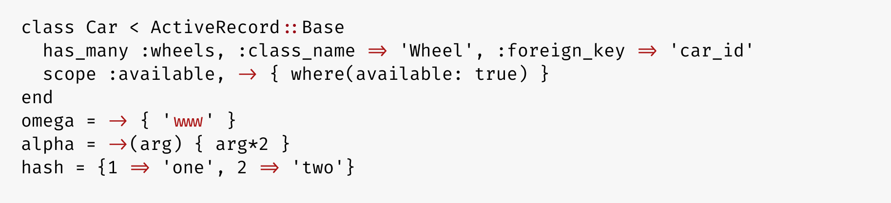
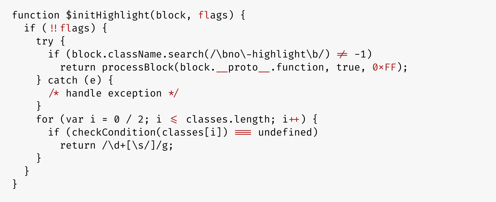
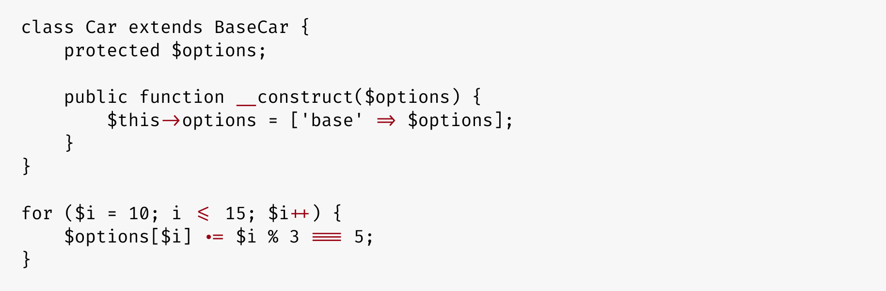
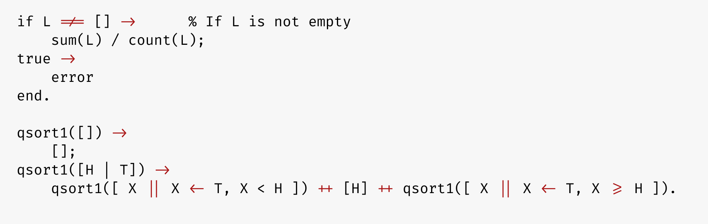
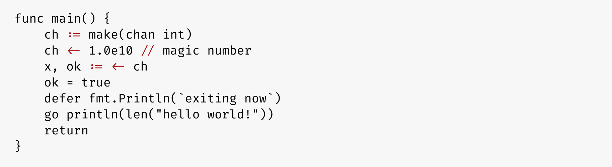
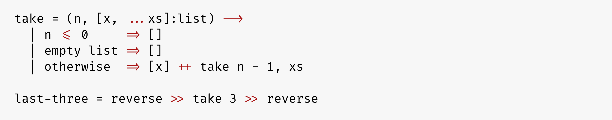
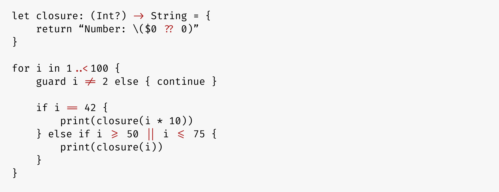

## Fira Code: free monospaced font with programming ligatures


### Problem

Programmers use a lot of symbols, often encoded with several characters. For the human brain, sequences like `->`, `<=` or `:=` are single logical tokens, even if they take two or three characters on the screen. Your eye spends a non-zero amount of energy to scan, parse and join multiple characters into a single logical one. Ideally, all programming languages should be designed with full-fledged Unicode symbols for operators, but that’s not the case yet.

### Solution

Fira Code is a free monospaced font containing ligatures for common programming multi-character combinations. This is just a font rendering feature: underlying code remains ASCII-compatible. This helps to read and understand code faster. For some frequent sequences like `..` or `//`, ligatures allow us to correct spacing.

### Download & Install

**<a href="https://github.com/tonsky/FiraCode/releases/download/3.1/FiraCode_3.1.zip">Download Fira Code v3.1</a>**

Then:

- <a href="https://github.com/tonsky/FiraCode/wiki">How to Install</a>
- <a href="https://github.com/tonsky/FiraCode/wiki#troubleshooting">Troubleshooting</a>
- <a href="https://twitter.com/FiraCode">News & Updates</a>

### Support

<a href="https://github.com/sponsors/tonsky" target="_blank"></a>

Fira Code is a personal, free-time project with no funding and huge [feature request backlog](https://github.com/tonsky/FiraCode/issues). If you love it, consider supporting its development via [GitHub Sponsors](https://github.com/sponsors/tonsky) or [Patreon](https://patreon.com/tonsky). Any help counts!

### What’s in the box?

Left: ligatures as rendered in Fira Code. Right: same character sequences without ligatures.


Fira Code comes with a few different character variants, so that everyone can choose what’s best for them. [How to enable](https://github.com/tonsky/FiraCode/wiki/How-to-enable-stylistic-sets)



In addition to that, Fira Code contains huge variety of Unicode characters well-suited for technical writing, math formulas and terminal UIs.



### Code examples

Ruby:



JavaScript:



PHP:



Erlang:



Elixir:


Go:



LiveScript:



Clojure:


Swift:



### Terminal compatibility list

| Works              | Doesn’t work       |
| ------------------ | ------------------ |
| **Butterfly**      | **Alacritty**      |
| **crosh** (ChromeOS, [instructions](https://github.com/tonsky/FiraCode/wiki/ChromeOS-Terminal)) | **Windows Console (conhost.exe)** |
| **Hyper.app**      | **Cmder**          |
| **iTerm 2** ([3.1+](https://gitlab.com/gnachman/iterm2/issues/3568#note_13118332)) | **ConEmu** |
| **Kitty**          | **GNOME Terminal** |
| **Konsole**        | **mate-terminal**  |
| **mintty** (partial support [2.8.3+](https://github.com/mintty/mintty/issues/601))| **PuTTY** |
| **QTerminal**      | **rxvt**           |
| **Terminal.app**   | **xterm**          |
| **Termux**         | **ZOC** (Windows)  |
| **Token2Shell/MD** | **gtkterm, guake, LXTerminal, sakura, Terminator, xfce4-terminal,** and other libvte-based terminals ([bug report](https://bugzilla.gnome.org/show_bug.cgi?id=584160)) |
| **upterm**         |
| **Windows Terminal** |
| **ZOC** (macOS)    |

### Editor compatibility list

| Works | Doesn’t work   |
| ----- | -------------- |
| **Abricotine** | **Arduino IDE** |
| **Android Studio** (2.3+, [instructions](https://github.com/tonsky/FiraCode/wiki/Intellij-products-instructions)) | **Adobe Dreamweaver** |
| **Anjuta** (unless at the EOF) | **Delphi IDE** |
| **AppCode** (2016.2+, [instructions](https://github.com/tonsky/FiraCode/wiki/Intellij-products-instructions)) | **Eclipse** (Windows, [vote here](https://bugs.eclipse.org/bugs/show_bug.cgi?id=398656)) |
| **Atom** 1.1 or newer ([instructions](https://github.com/tonsky/FiraCode/wiki/Atom-instructions)) | Standalone **Emacs** ([workaround](https://github.com/tonsky/FiraCode/wiki/Emacs-instructions)) |
| **BBEdit/TextWrangler** (v. 11 only, [instructions](https://github.com/tonsky/FiraCode/wiki/BBEdit-instructions)) | **Geany** (Windows) |
| **Brackets** (with [this plugin](https://github.com/polo2ro/firacode-in-brackets)) | **gVim** (Windows [workaround](https://github.com/tonsky/FiraCode/issues/462)) |
| **Chocolat** | **IDLE** |
| **CLion** (2016.2+, [instructions](https://github.com/tonsky/FiraCode/wiki/Intellij-products-instructions)) | **KDevelop 4** |
| **Cloud9** ([instructions](https://github.com/tonsky/FiraCode/wiki/Cloud9-Instructions)) | **MATLAB** |
| **Coda 2** | **Monkey Studio IDE** |
| **CodeLite** | **UltraEdit** |
| **Eclipse** (macOS 4.7+, Linux) |  |
| **elementary Code** |  |
| **Geany** (macOS) |
| **gEdit / Pluma** |
| **GNOME Builder** |
| **GoormIDE** ([instructions](https://github.com/tonsky/FiraCode/wiki/GoormIDE-Instructions)) |
| **IntelliJ IDEA** (2016.2+, [instructions](https://github.com/tonsky/FiraCode/wiki/Intellij-products-instructions)) |
| **Kate, KWrite** |
| **KDevelop 5+** |
| **Komodo** |
| **Leafpad** |
| **LibreOffice** |
| **LightTable** ([instructions](https://github.com/tonsky/FiraCode/wiki/LightTable-instructions)) |
| **LINQPad** |
| **MacVim** 7.4 or newer ([instructions](https://github.com/tonsky/FiraCode/wiki/MacVim-instructions)) |
| **Mancy** |
| **Meld** |
| **Mousepad** |
| **NeoVim-gtk** |
| **NetBeans** |
| **Notepad** (Windows) |
| **Notepad++** (with a [workaround](https://github.com/notepad-plus-plus/notepad-plus-plus/issues/2287#issuecomment-256638098))  |
| **Notepad3** ([instructions](https://github.com/rizonesoft/Notepad3/issues/361#issuecomment-365977420))|
| **PhpStorm** (2016.2+, [instructions](https://github.com/tonsky/FiraCode/wiki/Intellij-products-instructions)) |
| **PyCharm** (2016.2+, [instructions](https://github.com/tonsky/FiraCode/wiki/Intellij-products-instructions)) |
| **QtCreator** |
| **Rider** |
| **RStudio** ([instructions](https://github.com/tonsky/FiraCode/wiki/RStudio-instructions)) |
| **RubyMine** (2016.2+, [instructions](https://github.com/tonsky/FiraCode/wiki/Intellij-products-instructions)) |
| **Scratch** |
| **Scribus** (1.5.3+) |
| **SublimeText** (3146+) |
| **Spyder IDE** (only with Qt5) |
| **SuperCollider 3** |
| **TextAdept** (Linux, macOS) |
| **TextEdit** |
| **TextMate 2** |
| **VimR** ([instructions](https://github.com/qvacua/vimr/wiki#ligatures)) |
| **Visual Studio** (2015+, [instructions](https://github.com/tonsky/FiraCode/wiki/Visual-Studio-Instructions)) |
| **Visual Studio Code** ([instructions](https://github.com/tonsky/FiraCode/wiki/VS-Code-Instructions)) |
| **WebStorm** (2016.2+, [instructions](https://github.com/tonsky/FiraCode/wiki/Intellij-products-instructions)) |
| **Xamarin Studio/Monodevelop** |
| **Xcode** (8.0+, otherwise [with plugin](https://github.com/robertvojta/LigatureXcodePlugin)) |
| **Xi** |
| Probably work: **Smultron, Vico** | Under question: **Code::Blocks IDE** |

### Browser support

```html
<!-- HTML -->
<link rel="stylesheet" href="https://cdn.jsdelivr.net/gh/tonsky/FiraCode@3/distr/fira_code.css">
```

```css
/* CSS */
@import url(https://cdn.jsdelivr.net/gh/tonsky/FiraCode@3/distr/fira_code.css);
```

```css
/* Specify in CSS */
code { font-family: 'Fira Code', monospace; }

@supports (font-variation-settings: normal) {
  code { font-family: 'Fira Code VF', monospace; }
}
```


- IE 10+, Edge Legacy: enable with `font-feature-settings: "calt";`
- Firefox
- Safari
- Chromium-based browsers (Chrome, Opera)
- ACE
- CodeMirror (enable with `font-variant-ligatures: contextual;`)

### Projects using Fira Code

- All [JetBrains products](https://www.jetbrains.com/)
- [CodePen](https://codepen.io/)
- [Blink Shell](http://www.blink.sh/)
- [Klipse](http://app.klipse.tech/)
- [IlyaBirman.net](http://ilyabirman.net/)
- [EvilMartians.com](https://evilmartians.com/)
- [Web Maker](https://webmakerapp.com/)
- [FromScratch](https://fromscratch.rocks/)
- [PEP20.org](https://pep20.org/)

### Alternatives

Other free monospaced fonts with ligatures:

- [Hasklig](https://github.com/i-tu/Hasklig)
- [Monoid](http://larsenwork.com/monoid/)
- [Fixedsys Excelsior](https://github.com/kika/fixedsys)
- [Iosevka](https://be5invis.github.io/Iosevka/)
- [DejaVu Sans Code](https://github.com/SSNikolaevich/DejaVuSansCode)
- [Victor Mono](https://rubjo.github.io/victor-mono/)
- [Cascadia Code](https://github.com/microsoft/cascadia-code)
- [JetBrains Mono](https://github.com/JetBrains/JetBrainsMono)

Paid monospaced fonts with ligatures:

- [PragmataPro](http://www.fsd.it/fonts/pragmatapro.htm)
- [Mono Lisa](https://monolisa.dev/)

### Building Fira Code locally

In case you want to alter FiraCode.glyphs and build OTF/TTF/WOFF files yourself, this is setup I use on macOS:

```bash
# install all required build tools
./script/bootstrap

# build the font files
./script/build

# install OTFs to ~/Library/Fonts
./script/install
```

### Credits

- Author: Nikita Prokopov [@nikitonsky](https://twitter.com/nikitonsky)
- Based on: [Fira Mono](https://github.com/mozilla/Fira)
- Inspired by: [Hasklig](https://github.com/i-tu/Hasklig)
