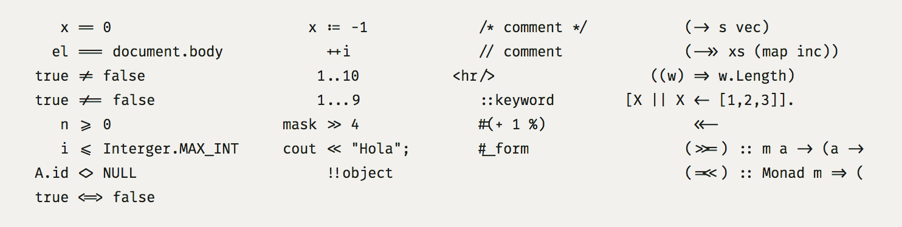
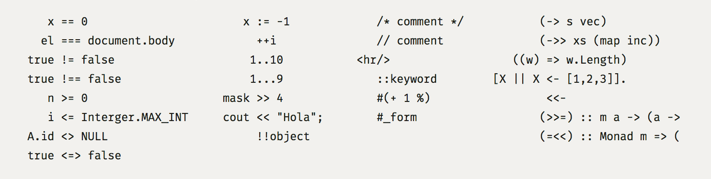

## Fira Code: monospaced font with programming ligatures

### Problem

Programmers use a lot of symbols, often encoded with several characters. For human brain sequences like `->`, `<=` or `:=` are single logical token, even if they take two or three places on the screen. Your eye spends non-zero amount of evergy to scan, parse and join multiple characters into a single logical one. Ideally, all programming languages should be designed with full-fledged Unicode symbols for operators, but that’s not the case yet.

### Solution

Fira Code is a Fira Mono font extended with a set of ligatures for common programming multi-character combinations. This is just a font rendering feature: underlying code remains ASCII-compatible. This helps to read and understand code faster. For some frequent sequences like `..` or `//` ligatures allow us to correct spacing.

### Fira Code (with ligatures):

Compare to Fira Mono (without ligatures):

#### [Download Fira Code v0.1](https://github.com/tonsky/FiraCode/releases/download/0.1/FiraCode-Regular.otf)

### Editor support

Please refer to [Hasklig Readme](https://github.com/i-tu/Hasklig) for editor support

### Credits

This work is based on OFL-licensed [Fira Mono font](https://github.com/mozilla/Fira). Original Fira Mono font was not changed, only extended.

Fira Code was inspired by [Hasklig font](https://github.com/i-tu/Hasklig): Ligatures for Haskell code

### Changelog

Version 0.1:

`>>=` `=<<` `<<=` `->>` `->` `=>` `<<-` `<-`  
`===` `==` `<=>` `>=` `<=` `>>` `<<` `!==` `!=` `<>`  
`:=` `++` `#(` `#_`  
`::` `...` `..` `!!` `//` `/*` `*/` `/>`  
