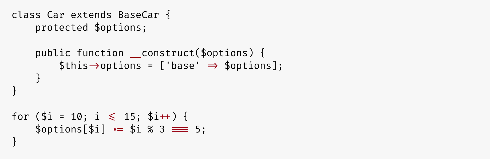

## Fira Code: monospaced font with programming ligatures


### Problem

Programmers use a lot of symbols, often encoded with several characters. For the human brain, sequences like `->`, `<=` or `:=` are single logical tokens, even if they take two or three characters on the screen. Your eye spends a non-zero amount of energy to scan, parse and join multiple characters into a single logical one. Ideally, all programming languages should be designed with full-fledged Unicode symbols for operators, but that’s not the case yet.

### Solution

#### [Download v1.204](https://github.com/tonsky/FiraCode/releases/download/1.204/FiraCode_1.204.zip) · [How to install](https://github.com/tonsky/FiraCode/wiki) · [Troubleshooting](https://github.com/tonsky/FiraCode/wiki#troubleshooting) · [News & updates](https://twitter.com/FiraCode)

Fira Code is an extension of the Fira Mono font containing a set of ligatures for common programming multi-character combinations. This is just a font rendering feature: underlying code remains ASCII-compatible. This helps to read and understand code faster. For some frequent sequences like `..` or `//`, ligatures allow us to correct spacing.


### Code examples

Ruby:


JavaScript:


PHP:



Erlang:


Elixir:


Go:


LiveScript:


Clojure:


Swift:


### Terminal support

| Works              | Doesn’t work       |
| ------------------ | ------------------ |
| **Butterfly**      | **Alacritty**      |
| **Hyper.app**      | **cmd.exe**        |
| **iTerm 2** ([since 3.1](https://gitlab.com/gnachman/iterm2/issues/3568#note_13118332)) | **Cmder** |
| **Kitty**          | **ConEmu**         |
| **Konsole**        | **GNOME Terminal** | 
| **QTerminal**      | **mate-terminal**  |
| **Terminal.app**   | **mintty**         |
| **Termux**         | **PuTTY**          |
| **Token2Shell/MD** | **rxvt**           |
| **upterm**         | **ZOC** (Windows)  |
| **ZOC** (macOS)    | **gtkterm, guake, LXTerminal, sakura, Terminator, xfce4-terminal,** and other libvte-based terminals ([bug report](https://bugzilla.gnome.org/show_bug.cgi?id=584160)) |

### Editor support

| Works | Doesn’t work   |
| ----- | -------------- |
| **Abricotine** | **Arduino IDE** |
| **Android Studio** (2.3+, [instructions](https://github.com/tonsky/FiraCode/wiki/Intellij-products-instructions)) | **Adobe Dreamweaver** |
| **Anjuta** (unless at the EOF) | **Delphi IDE** |
| **AppCode** (2016.2+, [instructions](https://github.com/tonsky/FiraCode/wiki/Intellij-products-instructions)) | **Eclipse** (Win, [vote here](https://bugs.eclipse.org/bugs/show_bug.cgi?id=398656)) |
| **Atom** 1.1 or newer ([instructions](https://github.com/tonsky/FiraCode/wiki/Atom-instructions)) | Standalone **Emacs** ([workaround](https://github.com/tonsky/FiraCode/wiki/Emacs-instructions)) |
| **BBEdit/TextWrangler** (v. 11 only, [instructions](https://github.com/tonsky/FiraCode/wiki/BBEdit-instructions)) | **gVim** (Windows [workaround](https://github.com/tonsky/FiraCode/issues/462)) |
| **Brackets** (with [this plugin](https://github.com/polo2ro/firacode-in-brackets)) | **IDLE** |
| **Chocolat** | **KDevelop 4** |
| **CLion** (2016.2+, [instructions](https://github.com/tonsky/FiraCode/wiki/Intellij-products-instructions)) | **Monkey Studio IDE** |
| **Cloud9** ([instructions](https://github.com/tonsky/FiraCode/wiki/Cloud9-Instructions)) |  |
| **Coda 2** |  |
| **CodeLite** |  |
| **Eclipse** (Mac 4.7+, Linux) |  |
| **Geany** |
| **gEdit / Pluma** |
| **GNOME Builder** |
| **IntelliJ IDEA** (2016.2+, [instructions](https://github.com/tonsky/FiraCode/wiki/Intellij-products-instructions)) |
| **Kate, KWrite** |
| **Komodo** |
| **Leafpad** |
| **LibreOffice** |
| **LightTable** ([instructions](https://github.com/tonsky/FiraCode/wiki/LightTable-instructions)) |
| **LINQPad** |
| **MacVim** 7.4 or newer ([instructions](https://github.com/tonsky/FiraCode/wiki/MacVim-instructions)) |
| **Mancy** |
| **Meld** |
| **Mousepad** |
| **NetBeans** |
| **Notepad** (Win) |
| **Notepad++** (with a [workaround](https://github.com/notepad-plus-plus/notepad-plus-plus/issues/2287#issuecomment-256638098))  |
| **PhpStorm** (2016.2+, [instructions](https://github.com/tonsky/FiraCode/wiki/Intellij-products-instructions)) |
| **PyCharm** (2016.2+, [instructions](https://github.com/tonsky/FiraCode/wiki/Intellij-products-instructions)) |
| **QtCreator** |
| **Rider** |
| **RStudio** ([instructions](https://github.com/tonsky/FiraCode/wiki/RStudio-instructions)) |
| **RubyMine** (2016.2+, [instructions](https://github.com/tonsky/FiraCode/wiki/Intellij-products-instructions)) |
| **Scratch** |
| **SublimeText** (3146+) |
| **Spyder IDE** (only with Qt5) |
| **SuperCollider 3** |
| **TextAdept** (Linux, Mac) |
| **TextEdit** |
| **TextMate 2** |
| **VimR** ([instructions](https://github.com/qvacua/vimr/wiki#ligatures)) |
| **Visual Studio 2015** |
| **Visual Studio 2017** |
| **Visual Studio Code** ([instructions](https://github.com/tonsky/FiraCode/wiki/VS-Code-Instructions)) |
| **WebStorm** (2016.2+, [instructions](https://github.com/tonsky/FiraCode/wiki/Intellij-products-instructions)) |
| **Xamarin Studio/Monodevelop** |
| **Xcode** (8.0+, otherwise [with plugin](https://github.com/robertvojta/LigatureXcodePlugin)) |
| Probably work: **Smultron, Vico** | Under question: **Code::Blocks IDE** |

### Browser support

```html
<!-- HTML -->
<link rel="stylesheet" href="https://cdn.rawgit.com/tonsky/FiraCode/1.204/distr/fira_code.css">
```

```css
/* CSS */
@import url(https://cdn.rawgit.com/tonsky/FiraCode/1.204/distr/fira_code.css);
```

- IE 10+, Edge: enable with `font-feature-settings: "calt" 1;`
- Firefox
- Safari
- Chromium-based browsers (Chrome, Opera)
- ACE
- CodeMirror (enable with `font-variant-ligatures: contextual;`)

### Projects using Fira Code

- All [JetBrains products](https://www.jetbrains.com/)
- [CodePen](https://codepen.io/)
- [Blink Shell](http://www.blink.sh/)
- [Klipse](http://app.klipse.tech/)
- [IlyaBirman.net](http://ilyabirman.net/)
- [EvilMartians.com](https://evilmartians.com/)

### Alternatives

Other monospaced fonts with ligatures:

- [Hasklig](https://github.com/i-tu/Hasklig) (free)
- [PragmataPro](http://www.fsd.it/fonts/pragmatapro.htm) (€59)
- [Monoid](http://larsenwork.com/monoid/) (free)
- [Fixedsys Excelsior](https://github.com/kika/fixedsys) (free)
- [Iosevka](https://be5invis.github.io/Iosevka/) (free)
- [DejaVu Sans Code](https://github.com/SSNikolaevich/DejaVuSansCode) (free)

### Credits

- Author: Nikita Prokopov [@nikitonsky](https://twitter.com/nikitonsky)
- Based on: [Fira Mono](https://github.com/mozilla/Fira)
- Inspired by: [Hasklig](https://github.com/i-tu/Hasklig)
- Software: [Glyphs 2](https://glyphsapp.com) (thx Georg Seifert for a license)
