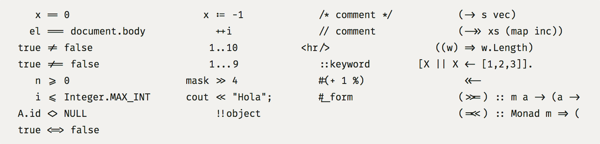
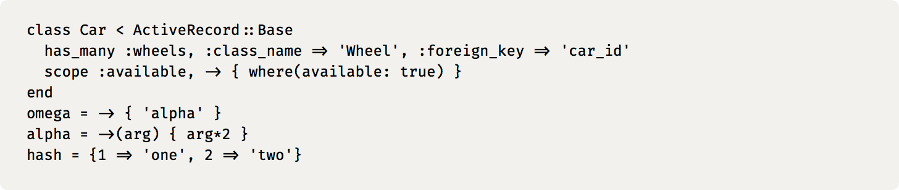
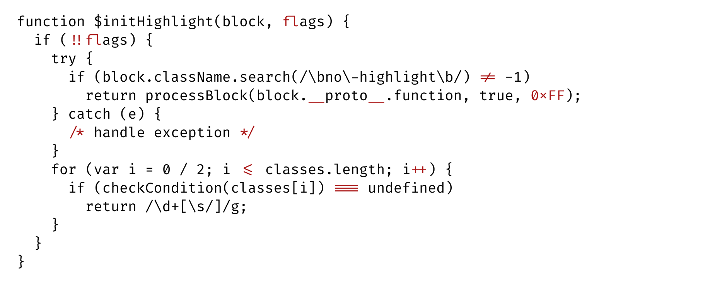
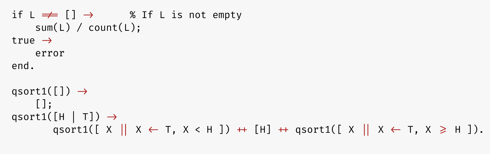
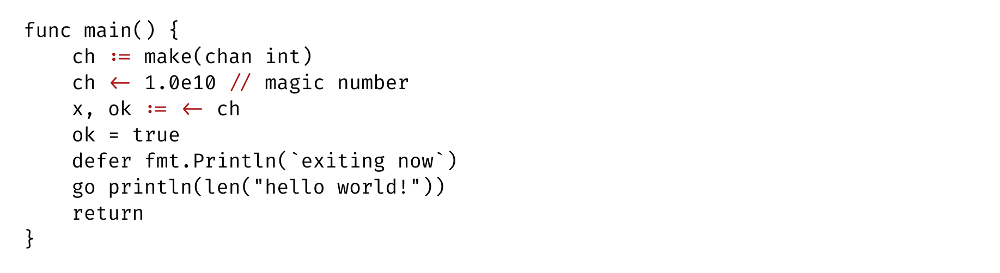
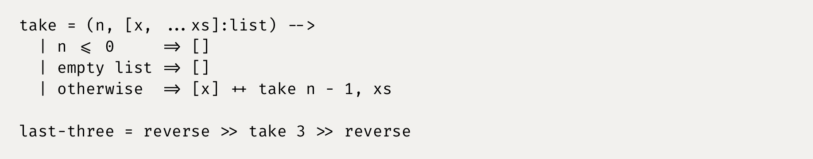
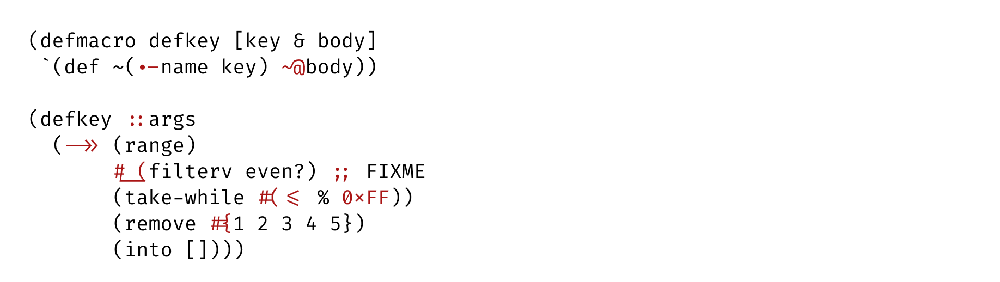

## Fira Code: monospaced font with programming ligatures

### Problem

Programmers use a lot of symbols, often encoded with several characters. For the human brain, sequences like `->`, `<=` or `:=` are single logical tokens, even if they take two or three characters on the screen. Your eye spends a non-zero amount of energy to scan, parse and join multiple characters into a single logical one. Ideally, all programming languages should be designed with full-fledged Unicode symbols for operators, but that’s not the case yet.

### Solution

#### [Download v1.204](https://github.com/tonsky/FiraCode/releases/download/1.204/FiraCode_1.204.zip) · [How to install](https://github.com/tonsky/FiraCode/wiki) · [News & updates](https://twitter.com/FiraCode)

Fira Code is an extension of the Fira Mono font containing a set of ligatures for common programming multi-character combinations. This is just a font rendering feature: underlying code remains ASCII-compatible. This helps to read and understand code faster. For some frequent sequences like `..` or `//`, ligatures allow us to correct spacing.

### Code examples

Ruby:

JavaScript:

Erlang:

Go:

LiveScript:

Clojure:

### Terminal support

Works            | Doesn’t work
---------------- | ---------------
**Black Screen** | **Cmder**
**Butterfly**    | **ConEmu**
**Hyper.app**    | **GNOME Terminal**
**Konsole**      | **iTerm 2** ([coming in 3.1](https://gitlab.com/gnachman/iterm2/issues/3568#note_13118332))
**QTerminal**    | **mate-terminal** 
**Terminal.app** (OS X default terminal) | **mintty**
**Termux** (Android terminal emulator) | **PuTTY**
                 | **rxvt**
                 | **gtkterm, guake, LXTerminal, sakura, Terminator, xfce4-terminal,** and other libvte-based terminals ([bug report](https://bugzilla.gnome.org/show_bug.cgi?id=584160))

### Editor support

Works | Doesn’t work
--------|----------------
**Anjuta** (unless at the EOF) | **Arduino IDE**
**AppCode** (2016.2+, [instructions](https://github.com/tonsky/FiraCode/wiki/Intellij-products-instructions)) | **Adobe Dreamweaver**
**Atom** 1.1 or newer ([instructions](https://github.com/tonsky/FiraCode/wiki/Atom-instructions)) | **Eclipse** (Mac and Win, [vote here](https://bugs.eclipse.org/bugs/show_bug.cgi?id=398656))
**BBEdit** ([instructions](https://github.com/tonsky/FiraCode/wiki/BBEdit-instructions)) | Standalone **Emacs** ([workaround](https://github.com/tonsky/FiraCode/wiki/Setting-up-Emacs))
**Brackets** (with [this plugin](https://github.com/polo2ro/firacode-in-brackets)) | **gVim**
**Chocolat** | **IDLE**
**CLion** (2016.2+, [instructions](https://github.com/tonsky/FiraCode/wiki/Intellij-products-instructions)) | **KDevelop 4**
**Coda 2** | **Monkey Studio IDE**
**CodeLite** | **Notepad++**
**Eclipse** (Linux) | **Spyder IDE**
**Geany** | **SublimeText** ([vote here](http://sublimetext.userecho.com/topic/1030059-does-sublimetext-support-programming-ligatures-fontlike-fira-code/))
**gEdit / Pluma** | 
**GNOME Builder** | 
**IntelliJ IDEA** (2016.2+, [instructions](https://github.com/tonsky/FiraCode/wiki/Intellij-products-instructions)) | 
**Kate, KWrite** |
**Komodo** |
**Leafpad** |
**LibreOffice** |
**LightTable** ([instructions](https://github.com/tonsky/FiraCode/wiki/LightTable-instructions)) | 
**MacVim** 7.4 or newer ([instructions](https://github.com/tonsky/FiraCode/wiki/MacVim-instructions)) |
**Mancy** |
**Meld** |
**Mousepad** |
**NetBeans** | 
**Notepad** (Win) |
**PhpStorm** (2016.2+, [instructions](https://github.com/tonsky/FiraCode/wiki/Intellij-products-instructions)) |
**PyCharm** (2016.2+, [instructions](https://github.com/tonsky/FiraCode/wiki/Intellij-products-instructions)) |
**QtCreator** | 
**RStudio** ([instructions](https://github.com/tonsky/FiraCode/wiki/RStudio-instructions)) |
**RubyMine** (2016.2+, [instructions](https://github.com/tonsky/FiraCode/wiki/Intellij-products-instructions)) |
**Scratch** |
**TextAdept** (Linux, Mac) |
**TextEdit** |
**TextMate 2** |
**Visual Studio 2015** |
**Visual Studio Code** ([instructions](https://github.com/tonsky/FiraCode/wiki/VS-Code-Instructions)) |
**WebStorm** (2016.2+, [instructions](https://github.com/tonsky/FiraCode/wiki/Intellij-products-instructions)) |
**Xamarin Studio/Monodevelop** |
**Xcode** (with [this plugin](https://github.com/robertvojta/LigatureXcodePlugin)) |
Probably work: **Smultron, Vico** | Under question: **Code::Blocks IDE**

### Browser support

- IE 10+, Edge: enable with `font-feature-settings: "calt" 1;`
- Firefox
- Safari
- Chromium-based browsers (Chrome, Opera):
  - enable with  `font-variant-ligatures: contextual;` or `text-rendering: optimizeLegibility`, see [571246](https://code.google.com/p/chromium/issues/detail?q=font-variant-ligatures&id=571246&thanks=571246&ts=1450553433&)
- ACE
- CodeMirror

### Alternatives

Other monospaced fonts with ligatures:

- [Hasklig](https://github.com/i-tu/Hasklig) (free)
- [PragmataPro](http://www.fsd.it/fonts/pragmatapro.htm) (€59)
- [Monoid](http://larsenwork.com/monoid/) (free)
- [Fixedsys Excelsior](https://github.com/kika/fixedsys) (free)
- [Iosevka](https://be5invis.github.io/Iosevka/) (free)
- [DejaVu Sans Code](https://github.com/SSNikolaevich/DejaVuSansCode) (free)

### Credits

- Author: Nikita Prokopov [@nikitonsky](https://twitter.com/nikitonsky)
- Based on: [Fira Mono](https://github.com/mozilla/Fira)
- Inspired by: [Hasklig](https://github.com/i-tu/Hasklig)
- Software: [Glyphs 2](https://glyphsapp.com) (thx Georg Seifert for a license)

### Changelog

#### 1.204 (November 6, 2016)

- Added `U+25B6` (black right-pointing triangle) and `U+25C0` (black left-pointing triangle) (#289)
- Changed look of Markdown headers `##` `###` `####` to make them easier to tell apart (#287)
- Fixed BBEdit incorrectly applying ligatures after tab (#274)
- Returned Nim pragmas `{.` `.}` (#279)
- Added Unicode increment `U+2206` (#174, #298)
- Added fish operators `>->` `<-<` (#297)
- Added safe navigation operators `?.` `.?` `?:` (#215)
- Added `<~>` (#179, used in IntelliJ for collapsed methods)
- Added F# piping operators `||>` `|||>` `<||` `<|||` (#184)
- Added shebang `#!` (#169, #193)

#### 1.203 (September 17, 2016)

- Added `__` (#120, #269)

#### 1.202 (September 17, 2016)

- Removed `{.` `.}` `[.` `.]` `(.` `.)` (#264)

#### 1.201 (August 30, 2016)

- Removed `[]` (#92) `{-` `-}` (#248)
- Removed `/**` `**/` and disabled ligatures for `/*/` `*/*` sequences (#219 #238)
- Added `]#` `{.` `.}` `[.` `.]` `(.` `.)` (#214)

#### 1.200 (July 18, 2016)

- Removed `!!!` `???` `;;;` `&&&` `|||` `=~` (#167) `~~~` `%%%`
- New safer `calt` code that doesn’t  apply ligatures to long sequences of chars, e.g. `!!!!`, `>>>>`, etc (#49, #110, #176)
- Larger `+` `-` `*` and corresponding ligatures (#86)
- Hexadecimal `x` (`0xFF`) is now applied to sequences like `128x128` as well (#161)
- Added twoTurned (U+218A) and threeTurned (U+218B) (#146)
- Added whiteFrowningFace (U+2639) (#190)
- Simplified visual style on markdown headers `##` `###` `####` (#107)
- Added `</>` (#147)
- Provided ttf and webfonts versions (eot, woff, woff2) (#18, #24, #38, #101, #106)
- Increased spacing in `<=` `>=` (#117)

#### 1.102

- Support for IntelliJ-based IDEs ([instructions](https://github.com/tonsky/FiraCode/wiki/Intellij-products-instructions))
- Turned on autohinting

#### 1.101

- Added Light weight
- Adjusted rules when vertical centering of `:`, `-`, `*` and `+` occurs

#### 1.100

- Fixed calt table conflicts (`----` would incorrectly render as `<!--`)
- Added centered `:` (between digits, e.g. `10:40`)
- Added lowercase-aligned `-`, `*` and `+` (only between lowercase letters, e.g. kebab case `var-name`, pointers `*ptr` etc)

#### 1.000

Added weights:

- Retina (just slightly heavier than Regular)
- Medium
- Bold

Switched to `calt` instead of `liga`. You can now “step inside” the ligature in text editors.

Fira Code is now drawn and built in Glyphs 2 app (should improve compatibility).

Added:

`<->` `<~~` `<~` `~~~` `~>` `~~>`  
`<$` `<+` `<*` `*>` `+>` `$>`  
`;;;` `:::` `!!!` `???` `%%` `%%%` `##` `###` `####`  
`.-` `#_(` `=<`  `**/` `0x` `www` `[]` 

Redrawn:

`{-` `-}` `~=` `=~` `=<<` `>>=` `<$>` `<=>` `.=`

Removed: `?:`

Total ligatures count: 115

#### 0.6

Redrawn from Fira Mono 3.204 (slightly heavier weight)

Added:

`**` `***` `+++` `--` `---` `?:`  
`/=` `/==` `.=` `^=` `=~` `?=` `||=` `|=`  
`<<<` `<=<` `-<<` `-<` `>-` `>>-` `>=>` `>>>`  
`<*>` `<|>` `<$>` `<+>`  
`<!--` `{-` `-}` `/**`  `\\` `\\\`
`..<` `??` `|||` `&&&` `<|` `|>`  
  
Added support for Powerline

#### 0.5

Added: `#{` `~-` `-~` `<==` `==>` `///` `;;` `</`

#### 0.4

- Added `~=` `~~` `#[`
- Rolled back `&&` and `||` to more traditional look
- `===` and `!==` are now rendered with 3 horizontal bars

#### 0.3

Added: `~@` `#?` `=:=` `=<`

#### 0.2.1

Fixed width of `&&` and `||`

#### 0.2

Added: `-->` `<--` `&&` `||` `=>>` `=/=`

#### 0.1

`>>=` `=<<` `<<=` `->>` `->` `=>` `<<-` `<-`  
`===` `==` `<=>` `>=` `<=` `>>` `<<` `!==` `!=` `<>`  
`:=` `++` `#(` `#_`  
`::` `...` `..` `!!` `//` `/*` `*/` `/>`  
