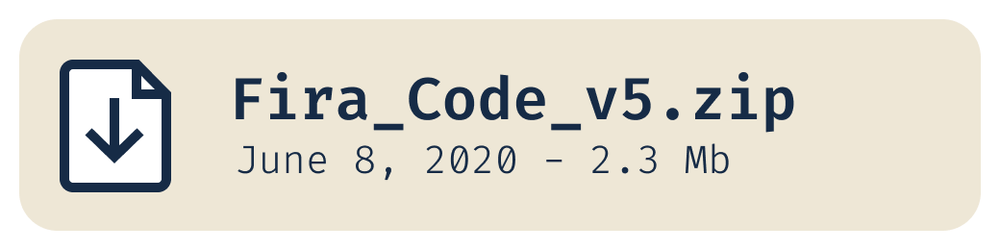
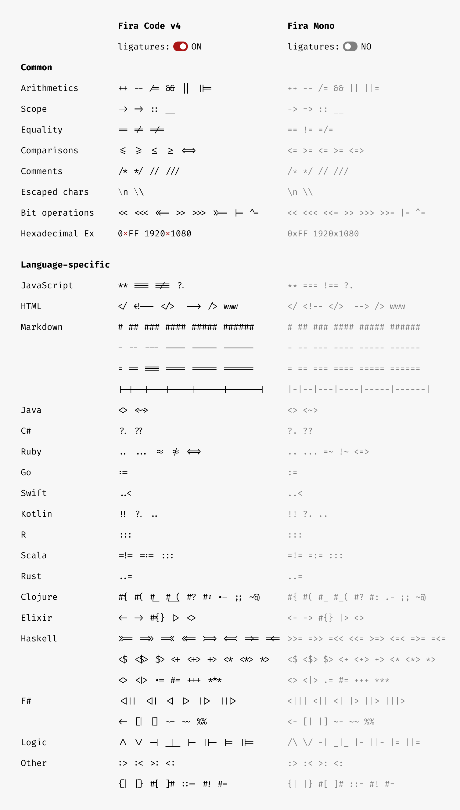
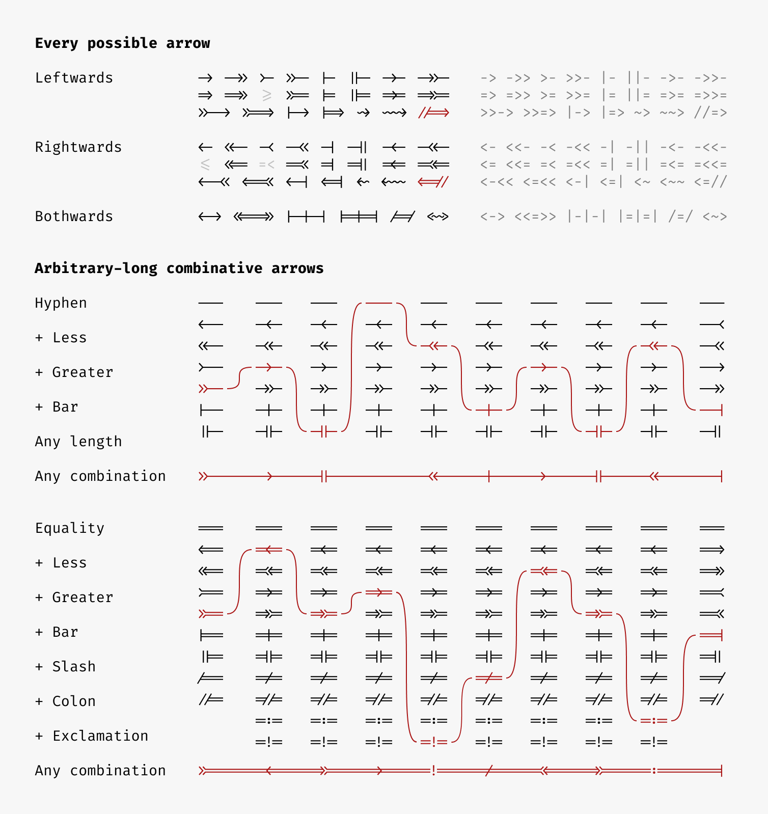
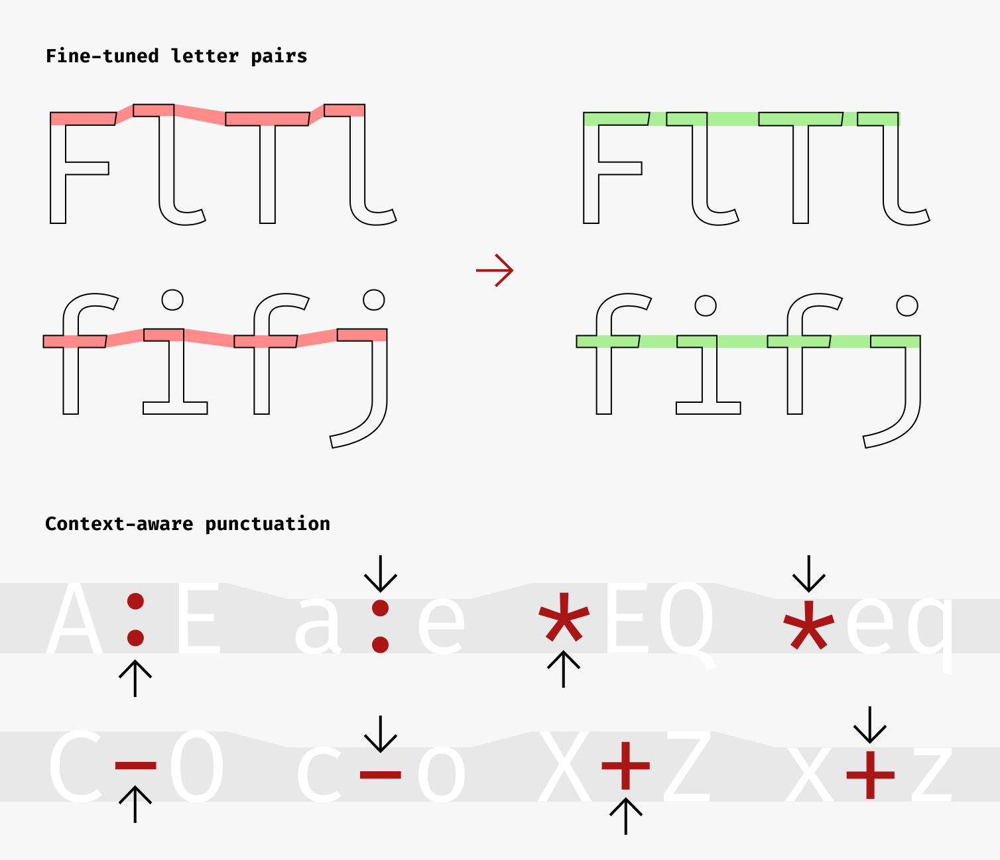
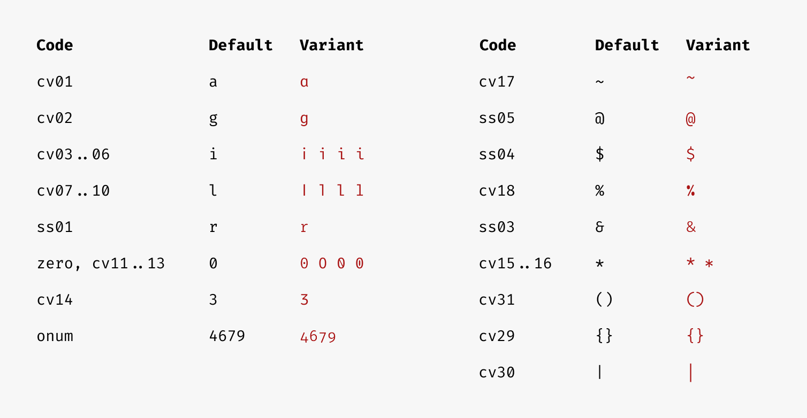
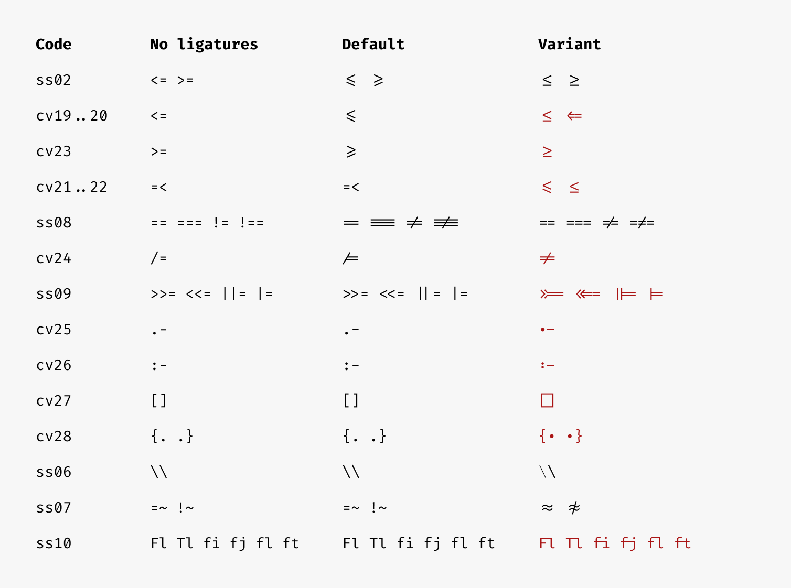
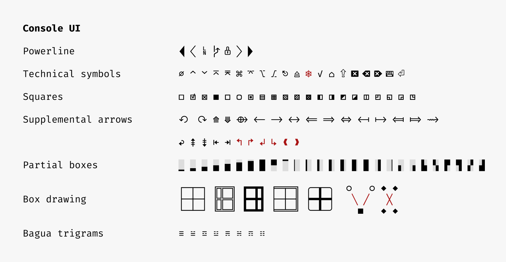
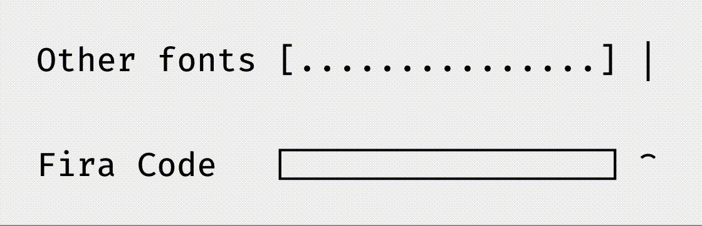
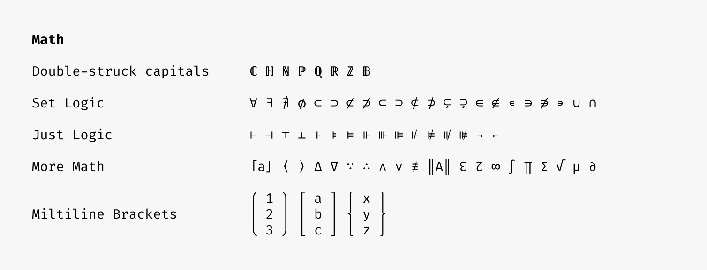

## Fira Code: free monospaced font with programming ligatures


Read in [Español](./LEEME.md) | [简体中文](./README_CN.md) | [日本語](./README_JA.md)

### Problem

Programmers use a lot of symbols, often encoded with several characters. For the human brain, sequences like `->`, `<=` or `:=` are single logical tokens, even if they take two or three characters on the screen. Your eye spends a non-zero amount of energy to scan, parse and join multiple characters into a single logical one. Ideally, all programming languages should be designed with full-fledged Unicode symbols for operators, but that’s not the case yet.

### Solution

Fira Code is a free monospaced font containing ligatures for common programming multi-character combinations. This is just a font rendering feature: underlying code remains ASCII-compatible. This helps to read and understand code faster. For some frequent sequences like `..` or `//`, ligatures allow us to correct spacing.

### Download & Install

<a href="https://github.com/tonsky/FiraCode/releases/download/6.2/Fira_Code_v6.2.zip"></a>

Then:

- [How to Install](https://github.com/tonsky/FiraCode/wiki)
- [Troubleshooting](https://github.com/tonsky/FiraCode/wiki#troubleshooting)
- [News & Updates](https://twitter.com/FiraCode)

### Sponsors

Fira Code is a personal, free-time project with no funding and a huge [feature request backlog](https://github.com/tonsky/FiraCode/issues). If you love it, consider supporting its development via [GitHub Sponsors](https://github.com/sponsors/tonsky) or [Patreon](https://patreon.com/tonsky). Any help counts!

Huge thanks to:

<table>
  <td align="center">
    <a href="https://workos.com/?utm_campaign=github_repo&utm_medium=referral&utm_content=firacode&utm_source=github">
      <div>
        
      </div>
      <b>Your app, enterprise-ready.</b>
      <div>
        <sub>Start selling to enterprise customers with just a few lines of code. Add Single Sign-On (and more) in minutes instead of months.</sup>
      </div>
    </a>
  </td>
</table>

### What’s in the box?

Left: ligatures as rendered in Fira Code. Right: same character sequences without ligatures.



Fira Code comes with a huge variety of arrows. Even better: you can make them as long as you like and combine start/middle/end fragments however you want!



Fira Code is not only about ligatures. Some fine-tuning is done for punctuation and frequent letter pairs.



Fira Code comes with a few different character variants (`cv01`, `cv02`, etc), stylistic sets (`ss01`, `ss02` , etc) and other font features (`zero`, `onum`, `calt`, etc), so that everyone can choose what’s best for them. [How to enable](https://github.com/tonsky/FiraCode/wiki/How-to-enable-stylistic-sets)



Some ligatures can be altered or enabled using stylistic sets/character variants:



Being a programming font, Fira Code has fantastic support for ASCII/box drawing, powerline and other forms of console UIs:



Fira Code is the first programming font to offer dedicated glyphs to render progress bars:


In action:



We hope more programming fonts will adopt this convention and ship their own versions.

Unicode coverage makes Fira Code a great choice for mathematical writing:



### How does it look?


### Editor compatibility list

| Works | Doesn’t work   |
|-------|----------------|
| **Arduino IDE** (2.0+,same instructions as [vscode](https://github.com/tonsky/FiraCode/wiki/VS-Code-Instructions)) | **Adobe Dreamweaver** |
| **Abricotine** | **Delphi IDE** |
| **Android Studio** (2.3+, [instructions](https://github.com/tonsky/FiraCode/wiki/IntelliJ-products-instructions)) | Standalone **Emacs** ([workaround](https://github.com/tonsky/FiraCode/wiki/Emacs-instructions)) |
| **Anjuta** (unless at the EOF) |  **IDLE** |
| **AppCode** (2016.2+, [instructions](https://github.com/tonsky/FiraCode/wiki/IntelliJ-products-instructions)) | **KDevelop 4** |
| **Atom** 1.1 or newer ([instructions](https://github.com/tonsky/FiraCode/wiki/Atom-instructions)) | **Monkey Studio IDE** |
| **BBEdit** (14.6+ [instructions](https://github.com/tonsky/FiraCode/wiki/BBEdit-instructions)) | **UltraEdit** (Windows) |
| **Brackets** (with [this plugin](https://github.com/polo2ro/firacode-in-brackets)) | 
| **Chocolat** |
| **CLion** (2016.2+, [instructions](https://github.com/tonsky/FiraCode/wiki/IntelliJ-products-instructions)) | 
| **Cloud9** ([instructions](https://github.com/tonsky/FiraCode/wiki/Cloud9-Instructions)) | 
| **Coda 2** |
| **CodeLite** |
| **CodeRunner** |
| **Comma** (Under: Preferences > Editor > Font) |
| **CotEditor** |
| **Eclipse** |
| **elementary Code** |
| **Geany** (1.37+) |
| **gEdit / Pluma** |
| **GNOME Builder** |
| **Godot** |
| **GoormIDE** ([instructions](https://github.com/tonsky/FiraCode/wiki/GoormIDE-Instructions)) |
| **gVim** ([Windows](https://github.com/tonsky/FiraCode/issues/462), [GTK](https://vimhelp.org/options.txt.html#%27guiligatures%27)) |
| **IntelliJ IDEA** (2016.2+, [instructions](https://github.com/tonsky/FiraCode/wiki/IntelliJ-products-instructions)) |
| **Kate, KWrite** |
| **KDevelop 5+** |
| **Komodo** |
| **Leafpad** |
| **LibreOffice** |
| **LightTable** ([instructions](https://github.com/tonsky/FiraCode/wiki/LightTable-instructions)) |
| **LINQPad** |
| **MacVim** 7.4 or newer ([instructions](https://github.com/tonsky/FiraCode/wiki/MacVim-instructions)) |
| **Mancy** |
| **MATLAB** ([instructions](https://github.com/tonsky/FiraCode/wiki/MATLAB-for-Windows-Instructions)) |
| **Meld** |
| **Mousepad** |
| **NeoVim-gtk** |
| **NetBeans** |
| **Notepad** (Windows) |
| **Notepad++** (with a [workaround](https://github.com/notepad-plus-plus/notepad-plus-plus/issues/2287#issuecomment-256638098))  |
| **Notepad3** ([instructions](https://github.com/rizonesoft/Notepad3/issues/361#issuecomment-365977420))|
| **Nova** |
| **PhpStorm** (2016.2+, [instructions](https://github.com/tonsky/FiraCode/wiki/IntelliJ-products-instructions)) |
| **PyCharm** (2016.2+, [instructions](https://github.com/tonsky/FiraCode/wiki/IntelliJ-products-instructions)) |
| **QOwnNotes** (21.16.6+) |
| **QtCreator** |
| **Rider** |
| **RStudio** ([instructions](https://github.com/tonsky/FiraCode/wiki/RStudio-instructions)) |
| **RubyMine** (2016.2+, [instructions](https://github.com/tonsky/FiraCode/wiki/IntelliJ-products-instructions)) |
| **Scratch** |
| **Scribus** (1.5.3+) |
| **SublimeText** (3146+) |
| **Spyder IDE** (only with Qt5) |
| **SuperCollider 3** |
| **TeXShop**|
| **TextAdept** (Linux, macOS) |
| **TextEdit** |
| **TextMate 2** |
| **UltraEdit (UEX)** (Linux) |
| **VimR** ([instructions](https://github.com/qvacua/vimr/wiki#ligatures)) |
| **Visual Studio** (2015+, [instructions](https://github.com/tonsky/FiraCode/wiki/Visual-Studio-Instructions)) |
| **Visual Studio Code** ([instructions](https://github.com/tonsky/FiraCode/wiki/VS-Code-Instructions)) |
| **WebStorm** (2016.2+, [instructions](https://github.com/tonsky/FiraCode/wiki/IntelliJ-products-instructions)) |
| **Xamarin Studio/Monodevelop** |
| **Xcode** (8.0+, otherwise [with plugin](https://github.com/robertvojta/LigatureXcodePlugin)) |
| **Xi** |
| Probably work: **Smultron, Vico** | Under question: **Code::Blocks IDE** |

### Terminal compatibility list

| Works | Doesn’t work |
|-------|--------------|
| crosh ([instructions](https://github.com/tonsky/FiraCode/wiki/ChromeOS-Terminal)) | Alacritty |
| Hyper (see [#3607](https://github.com/vercel/hyper/issues/3607)) | Asbru Connection Manager |
| iTerm 2 | Cmder |
| Kitty | ConEmu |
| Konsole | GNOME Terminal |
| Mintty | gtkterm ([ticket](https://gitlab.gnome.org/GNOME/vte/-/issues/1661)) |
| QTerminal | guake ([ticket](https://gitlab.gnome.org/GNOME/vte/-/issues/1661)) |
| st ([patch](https://st.suckless.org/patches/ligatures/)) | LXTerminal ([ticket](https://gitlab.gnome.org/GNOME/vte/-/issues/1661)) |
| Tabby | mate-terminal |
| Terminal.app | PuTTY |
| Termux | rxvt |
| Token2Shell | sakura ([ticket](https://gitlab.gnome.org/GNOME/vte/-/issues/1661)) |
| Wez’s terminal | SecureCRT
| Windows Terminal | Terminator ([ticket](https://gitlab.gnome.org/GNOME/vte/-/issues/1661)) |
| ZOC (macOS) | terminology |
| | Tilix |
| | Windows Console |
| | xfce4-terminal ([ticket](https://gitlab.gnome.org/GNOME/vte/-/issues/1661)) |
| | xterm |
| | ZOC (Windows) |

### Browser support

```html
<!-- HTML -->
<link rel="stylesheet" href="https://cdn.jsdelivr.net/npm/firacode@6.2.0/distr/fira_code.css">
```

```css
/* CSS */
@import url(https://cdn.jsdelivr.net/npm/firacode@6.2.0/distr/fira_code.css);
```

```css
/* Specify in CSS */
code { font-family: 'Fira Code', monospace; }

@supports (font-variation-settings: normal) {
  code { font-family: 'Fira Code VF', monospace; }
}
```

- IE 10+, Edge Legacy: enable with `font-feature-settings: "calt";`
- Firefox
- Safari
- Chromium-based browsers (Chrome, Opera)
- ACE
- CodeMirror (enable with `font-variant-ligatures: contextual;`)

### Projects using Fira Code

- [CodePen](https://codepen.io/)
- [Blink Shell](http://www.blink.sh/)
- [Klipse](http://app.klipse.tech/)
- [IlyaBirman.net](http://ilyabirman.net/)
- [EvilMartians.com](https://evilmartians.com/)
- [Web Maker](https://webmakerapp.com/)
- [FromScratch](https://fromscratch.rocks/)
- [PEP20.org](https://pep20.org/)

### Alternatives

Free monospaced fonts with ligatures:

- [Hasklig](https://github.com/i-tu/Hasklig)
- [Monoid](http://larsenwork.com/monoid/)
- [Fixedsys Excelsior](https://github.com/kika/fixedsys)
- [Iosevka](https://be5invis.github.io/Iosevka/)
- [DejaVu Sans Code](https://github.com/SSNikolaevich/DejaVuSansCode)
- [Victor Mono](https://rubjo.github.io/victor-mono/)
- [Cascadia Code](https://github.com/microsoft/cascadia-code)
- [JetBrains Mono](https://github.com/JetBrains/JetBrainsMono)

Paid monospaced fonts with ligatures:

- [PragmataPro](http://www.fsd.it/fonts/pragmatapro.htm)
- [Mono Lisa](https://www.monolisa.dev/)

### Building Fira Code locally

In case you want to alter FiraCode.glyphs and build OTF/TTF/WOFF files yourself, this is the setup I use on macOS:

```bash
# install all required build tools
./script/bootstrap_macos.sh

# build the font files
./script/build.sh

# install OTFs to ~/Library/Fonts
cp distr/otf/*.otf ~/Library/Fonts
```

Alternatively, you can build Fira Code using Docker:

```bash
# install dependencies in a container and build the font files
make

# package the font files from dist/ into a zip
make package
```

If you want to *permanently enable* certain style sets or character variations, maybe because your editor of choice does not allow you to toggle these individually, you can provide the desired features as a comma separated list to the build script via the `-f / --features` flag.<br>Default: none.

To separate different versions of your font you can specify the desired font family name with the `-n / --family-name` flag. The special value 'features' will append a sorted, space separated list of enabled features to the default family name.<br>Default: "Fira Code"

You can also limit the font weights that will be created with the `-w / --weights` option.<br>Default: "Light,Regular,Retina,Medium,SemiBold,Bold"

```bash
# locally in your shell
./script/build.sh --features "ss02,ss08,ss10,cv03,cv07,cv14" --family-name "Fira Code straight" --weights "Regular,Bold"

# or via a docker container (creates the family name 'Fira Code cv01 cv02 cv06 cv31 onum ss01 ss03 ss04 zero')
docker run --rm -v "${PWD}":/opt tonsky/firacode:latest ./script/build.sh -f "cv01,cv02,cv06,ss01,zero,onum,ss03,ss04,cv31" -n "features"

# in Git Bash from Git for Windows, or any other MSYS2 based shell, you might need to disable path conversion
MSYS2_ARG_CONV_EXCL="*" docker run --rm -v "${PWD}":/opt tonsky/firacode:latest ./script/build.sh -f "ss02,ss03,ss04,ss05,ss06,ss07"
```

### Credits

- Author: Nikita Prokopov [@nikitonsky](https://twitter.com/nikitonsky)
- Based on: [Fira Mono](https://github.com/mozilla/Fira)
- Inspired by: [Hasklig](https://github.com/i-tu/Hasklig)
