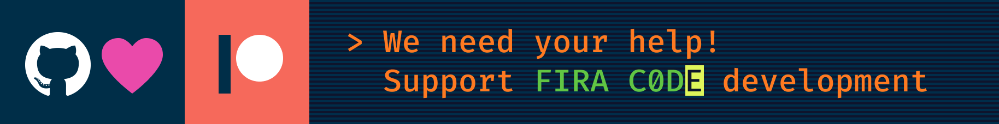

## Fira Code字体是一种适用于编程的等宽字体。使用它可以减少我们在编程时处理逻辑标记的脑力消耗。


### 问题

开发者们使用的多标记，通常都是用几个字符编码。对于人的大脑来说，像`->`、`<=`或`:=`这样的序列是单一的逻辑标记，即使它们在屏幕上显示两到三个字符。您的眼睛并非无消耗的来扫描、解析并将多个字符连接到一个逻辑字符中。理想情况下，所有编程语言都应该为操作符设计成熟的Unicode符号，但现在还不是这样。

### 方案

Fira Code是一种免费的等宽字体，包含常用的编程语言中多种字符组合的连字。这只是一个字体呈现功能，底层代码仍然与ASCII兼容。这有助于更快地阅读和理解代码。对于一些常见的序列，如`..`或`//`，连字允许我们纠正间距。

### 下载和安装

<a href="https://github.com/tonsky/FiraCode/releases/download/6.2/Fira_Code_v6.2.zip"></a>

下一步:

- [如何安装](https://github.com/tonsky/FiraCode/wiki)
- [安装文档](https://github.com/tonsky/FiraCode/wiki#troubleshooting)
- [相关新闻](https://twitter.com/FiraCode)

### Support

<a href="https://github.com/sponsors/tonsky" target="_blank"></a>

Fira Code 是一个个人项目,没有资金和巨大的空闲时间项目 [feature request backlog](https://github.com/tonsky/FiraCode/issues). 如果你也热爱这个项目, 考虑通过以下途径支持其发展 [GitHub Sponsors](https://github.com/sponsors/tonsky) 或 [Patreon](https://patreon.com/tonsky). 任何帮助都是有价值的!

### 字体里都有哪些特征?

左侧：Fira Code中呈现的连字。右侧：没有连字的相同字符序列。


Fira Code 带有种类繁多的箭头。更棒的是：您可以随心所欲地制作它们，并根据需要组合开始/中间/结束片段！


Fira Code 不仅与连字有关，还对标点符号和频繁的字母对进行了一些微调。


Fira Code 附带了几个不同的字符变体，以便每个人都可以选择最适合自己的. [How to enable](https://github.com/tonsky/FiraCode/wiki/How-to-enable-stylistic-sets)


可以使用样式集/字符变体更改或启用某些连字：


作为一种编程字体，Fira Code 对 ASCII/框绘图、电力线和其他形式的控制台 UI 具有出色的支持：


Fira Code 是第一个提供专用字形来渲染进度条的编程字体：


在不断更新的进度条中:


我们希望更多的编程字体能够采用这个约定并发布自己的版本。

Unicode 覆盖使 Fira Code 成为数学写作的绝佳选择：


### 它看起来怎样?


### 编辑器兼容性列表

| Works | Doesn’t work   |
|-------|----------------|
| **Abricotine** | **Arduino IDE** |
| **Android Studio** (2.3+, [instructions](https://github.com/tonsky/FiraCode/wiki/IntelliJ-products-instructions)) | **Adobe Dreamweaver** |
| **Anjuta** (unless at the EOF) | **Delphi IDE** |
| **AppCode** (2016.2+, [instructions](https://github.com/tonsky/FiraCode/wiki/IntelliJ-products-instructions)) | Standalone **Emacs** ([workaround](https://github.com/tonsky/FiraCode/wiki/Emacs-instructions)) |
| **Atom** 1.1 or newer ([instructions](https://github.com/tonsky/FiraCode/wiki/Atom-instructions)) | **Godot** ([issue](https://github.com/godotengine/godot/issues/9961)) |
| **BBEdit/TextWrangler** (v. 11 only, [instructions](https://github.com/tonsky/FiraCode/wiki/BBEdit-instructions)) | **IDLE** |
| **Brackets** (with [this plugin](https://github.com/polo2ro/firacode-in-brackets)) | **KDevelop 4** |
| **Chocolat** | **Monkey Studio IDE** |
| **CLion** (2016.2+, [instructions](https://github.com/tonsky/FiraCode/wiki/IntelliJ-products-instructions)) | **UltraEdit** |
| **Cloud9** ([instructions](https://github.com/tonsky/FiraCode/wiki/Cloud9-Instructions)) | 
| **Coda 2** |
| **CodeLite** |
| **CodeRunner** |
| **CotEditor** |
| **Eclipse** |
| **elementary Code** |
| **Geany** (1.37+) |
| **gEdit / Pluma** |
| **GNOME Builder** |
| **GoormIDE** ([instructions](https://github.com/tonsky/FiraCode/wiki/GoormIDE-Instructions)) |
| **gVim** ([Windows](https://github.com/tonsky/FiraCode/issues/462), [GTK](https://vimhelp.org/options.txt.html#%27guiligatures%27)) |
| **IntelliJ IDEA** (2016.2+, [instructions](https://github.com/tonsky/FiraCode/wiki/IntelliJ-products-instructions)) |
| **Kate, KWrite** |
| **KDevelop 5+** |
| **Komodo** |
| **Leafpad** |
| **LibreOffice** |
| **LightTable** ([instructions](https://github.com/tonsky/FiraCode/wiki/LightTable-instructions)) |
| **LINQPad** |
| **MacVim** 7.4 or newer ([instructions](https://github.com/tonsky/FiraCode/wiki/MacVim-instructions)) |
| **Mancy** |
| **MATLAB** ([instructions](https://github.com/tonsky/FiraCode/wiki/MATLAB-for-Windows-Instructions)) |
| **Meld** |
| **Mousepad** |
| **NeoVim-gtk** |
| **NetBeans** |
| **Notepad** (Windows) |
| **Notepad++** (with a [workaround](https://github.com/notepad-plus-plus/notepad-plus-plus/issues/2287#issuecomment-256638098))  |
| **Notepad3** ([instructions](https://github.com/rizonesoft/Notepad3/issues/361#issuecomment-365977420))|
| **Nova** |
| **PhpStorm** (2016.2+, [instructions](https://github.com/tonsky/FiraCode/wiki/IntelliJ-products-instructions)) |
| **PyCharm** (2016.2+, [instructions](https://github.com/tonsky/FiraCode/wiki/IntelliJ-products-instructions)) |
| **QOwnNotes** (21.16.6+) |
| **QtCreator** |
| **Rider** |
| **RStudio** ([instructions](https://github.com/tonsky/FiraCode/wiki/RStudio-instructions)) |
| **RubyMine** (2016.2+, [instructions](https://github.com/tonsky/FiraCode/wiki/IntelliJ-products-instructions)) |
| **Scratch** |
| **Scribus** (1.5.3+) |
| **SublimeText** (3146+) |
| **Spyder IDE** (only with Qt5) |
| **SuperCollider 3** |
| **TextAdept** (Linux, macOS) |
| **TextEdit** |
| **TextMate 2** |
| **VimR** ([instructions](https://github.com/qvacua/vimr/wiki#ligatures)) |
| **Visual Studio** (2015+, [instructions](https://github.com/tonsky/FiraCode/wiki/Visual-Studio-Instructions)) |
| **Visual Studio Code** ([instructions](https://github.com/tonsky/FiraCode/wiki/VS-Code-Instructions)) |
| **WebStorm** (2016.2+, [instructions](https://github.com/tonsky/FiraCode/wiki/IntelliJ-products-instructions)) |
| **Xamarin Studio/Monodevelop** |
| **Xcode** (8.0+, otherwise [with plugin](https://github.com/robertvojta/LigatureXcodePlugin)) |
| **Xi** |
| Probably work: **Smultron, Vico** | Under question: **Code::Blocks IDE** |

### 终端兼容性列表

| Platform       | Works | Doesn’t work |
|----------------|-------|--------------|
| macOS          | Hyper (see [#3607](https://github.com/vercel/hyper/issues/3607))<br>iTerm 2<br>Kitty<br>Terminal.app<br>ZOC | Alacritty |
| Windows        | Hyper (see [#3607](https://github.com/vercel/hyper/issues/3607))<br>Mintty<br>Token2Shell<br>Windows Terminal | Alacritty<br>Cmder<br>ConEmu<br>PuTTY<br>Windows Console<br>ZOC |
| Linux          | Hyper (see [#3607](https://github.com/vercel/hyper/issues/3607))<br>Kitty<br>Konsole<br>QTerminal<br>Termux<br>st ([patch](https://st.suckless.org/patches/ligatures/)) | Alacritty<br>GNOME Terminal<br>libvte-based terminals ([bug report](https://bugzilla.gnome.org/show_bug.cgi?id=584160)): <ul><li>gtkterm<li>guake<li>LXTerminal<li> sakura<li>Terminator<li>xfce4-terminal</ul>mate-terminal<br>rxvt<br>terminology<br>xterm
| ChromeOS       | crosh ([instructions](https://github.com/tonsky/FiraCode/wiki/ChromeOS-Terminal)) | |

### 在浏览器中使用

```html
<!-- HTML -->
<link rel="stylesheet" href="https://cdn.jsdelivr.net/npm/firacode@6.2.0/distr/fira_code.css">
```

```css
/* CSS */
@import url(https://cdn.jsdelivr.net/npm/firacode@6.2.0/distr/fira_code.css);
```

```css
/* Specify in CSS */
code { font-family: 'Fira Code', monospace; }

@supports (font-variation-settings: normal) {
  code { font-family: 'Fira Code VF', monospace; }
}
```

- IE 10+, Edge Legacy: enable with `font-feature-settings: "calt";`
- Firefox
- Safari
- Chromium-based browsers (Chrome, Opera)
- ACE
- CodeMirror (enable with `font-variant-ligatures: contextual;`)

### 正在使用 Fira Code的项目

- [CodePen](https://codepen.io/)
- [Blink Shell](http://www.blink.sh/)
- [Klipse](http://app.klipse.tech/)
- [IlyaBirman.net](http://ilyabirman.net/)
- [EvilMartians.com](https://evilmartians.com/)
- [Web Maker](https://webmakerapp.com/)
- [FromScratch](https://fromscratch.rocks/)
- [PEP20.org](https://pep20.org/)

### 备选方案

带连字的免费等宽字体：

- [Hasklig](https://github.com/i-tu/Hasklig)
- [Monoid](http://larsenwork.com/monoid/)
- [Fixedsys Excelsior](https://github.com/kika/fixedsys)
- [Iosevka](https://be5invis.github.io/Iosevka/)
- [DejaVu Sans Code](https://github.com/SSNikolaevich/DejaVuSansCode)
- [Victor Mono](https://rubjo.github.io/victor-mono/)
- [Cascadia Code](https://github.com/microsoft/cascadia-code)
- [JetBrains Mono](https://github.com/JetBrains/JetBrainsMono)

带连字的付费等宽字体:

- [PragmataPro](http://www.fsd.it/fonts/pragmatapro.htm)
- [Mono Lisa](https://www.monolisa.dev/)

### 在本地构建 Fira Code

如果您想更改 FiraCode.glyphs 并自己构建 OTF / TTF / WOFF 文件，这是我在 macOS 上使用的设置：

```bash
# install all required build tools
./script/bootstrap_macos.sh

# build the font files
./script/build.sh

# install OTFs to ~/Library/Fonts
cp distr/otf/*.otf ~/Library/Fonts
```

Alternatively, you can build Fira Code using Docker:

```bash
# install dependencies in a container and build the font files
make

# package the font files from dist/ into a zip
make package
```

### 制作人员

- 作者: Nikita Prokopov [@nikitonsky](https://twitter.com/nikitonsky)
- 基于此项目: [Fira Mono](https://github.com/mozilla/Fira)
- 灵感来源: [Hasklig](https://github.com/i-tu/Hasklig)
- 翻译：墨抒颖[@moshuying](https://github.com/moshuying)
